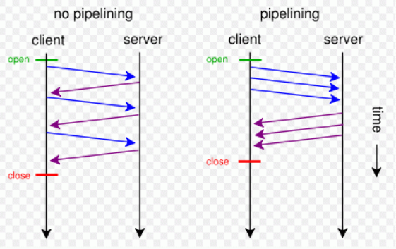

# HTTP

HTTP 是 Hyper Text Transfer Protocol（超文本传输协议）的缩写。它是一个应用层协议，由请求和响应构成，是一个标准的客户端服务器模型。HTTP 是一个无状态的协议。

### HTTP 协议的特点

- 无连接
  - 限制每次连接只处理一个请求
- 无状态
  - 协议对于事务处理没有记忆能力。
- 简单快速
  - 客户向服务器请求服务时，只需传送请求方法和路径。
- 灵活
  - HTTP 允许传输任意类型的数据对象。正在传输的类型由 Content-Type 加以标记。

### 请求报文

- 请求行
  - 请求类型
  - 要访问的资源
  - HTTP 协议版本号
- 请求头
  - 用来说明服务器要使用的附加信息（一些键值对）
  - 例如：User-Agent、 Accept、Content-Type、Connection
- 空行
  - 分割请求头与请求体
- 请求体
  - 可以添加任意的其他数据

### 响应报文

- 状态行
  - 状态码
  - 状态消息
  - HTTP 协议版本号
- 消息报头
  - 说明客户端要使用的一些附加信息
  - 如：Content-Type、charset、响应的时间
- 响应正文
  - 返回给客户端的文本信息

### HTTP 方法

- GET
  - 获取资源
- POST
  - 传输资源
- PUT
  - 更新资源
- DELETE
  - 删除资源
- HEAD
  - 获取报文首部

### Post 和 Get 的区别

- GET 在浏览器回退时是无害的，而 POST 会再次提交
- Get 请求能缓存，Post 不能
- Post 相对 Get 相对安全一些，因为 Get 请求都包含在 URL 中，而且会被浏览器保存记录，Post 不会。但是再抓包的情况下都是一样的。
- Post 可以通过 request body 来传输比 Get 更多的数据
- URL 有长度限制，会影响 Get 请求，但是这个长度限制是浏览器规定的
- Post 支持更多的编码类型且不对数据类型限制
- POST，浏览器先发送 header，服务器响应 100 continue，浏览器再发送 data，服务器响应 200 ok(返回数据)

先引入副作用和幂等的概念。
副作用指对服务器上的资源做改变，搜索是无副作用的，注册是副作用的。
幂等指发送 M 和 N 次请求（两者不相同且都大于 1），服务器上资源的状态一致，比如注册 10 个和 11 个帐号是不幂等的，对文章进行更改 10 次和 11 次是幂等的。
在规范的应用场景上说，Get 多用于无副作用，幂等的场景，例如搜索关键字。Post 多用于副作用，不幂等的场景，例如注册。

### 常见状态码

#### 1XX 指示信息

表示请求已接收，继续处理

#### 2XX 成功

- **200** OK
- 201 Created 通常指 POST 请求的结果，已在服务器上成功创建了一个或多个新资源。
- 202 Accepted 表示已接受处理请求，但处理尚未完成，表异步。
- 204 No content，表示请求成功，但响应报文不含实体的主体部分
- 205 Reset Content，表示请求成功，但响应报文不含实体的主体部分，但是与 204 响应不同在于要求请求方重置内容
- **206** Partial Content，进行范围请求

#### 3XX 重定向

- **301** 永久性重定向，表示资源已被分配了新的 URL
- **302** 临时性重定向，表示资源临时被分配了新的 URL
- 303 表示资源存在着另一个 URL，应使用 GET 方法获取资源
- **304** 未修改，重定位到浏览器。自从上次请求后，请求的网页未修改过。服务器返回此响应时，不会返回网页内容。如果网页自请求者上次请求后再也没有更改过，您应将服务器配置为返回此响应（称为 If-Modified-Since HTTP 标头）。服务器可以告诉 Googlebot 自从上次抓取后网页没有变更，进而节省带宽和开销。
- 307 临时重定向，和 302 含义类似，但是期望客户端保持请求方法不变向新的地址发出请求

#### 4XX 客户端错误

- **404** 在服务器上没有找到请求的资源
- **403** Forbidden，用户被认证后，用户没有被授权在特定资源上执行操作的权限
- 400 请求报文存在语法错误
- 401 Unauthorized， 表示请求没有被认证，或者认证不正确请重新认证和重试。

#### 5XX 服务器错误

- **500** 表示服务器端在执行请求时发生了错误
- 501 表示服务器不支持当前请求所需要的某个功能
- **503** 表明服务器暂时处于超负载或正在停机维护，无法处理请求

### HTTP 持久连接（HTTP1.1 支持）

HTTP 协议采用“请求-应答”模式，并且 HTTP 是基于 TCP 进行连接的。普通模式（非 keep-alive）时，每个请求或应答都需要建立一个连接，完成之后立即断开。

当使用`Conection: keep-alive`模式（又称持久连接、连接重用）时，keep-alive 使客户端道服务器端连接持续有效，即不关闭底层的 TCP 连接，当出现对服务器的后继请求时，keep-alive 功能避免重新建立连接。

### HTTP 管线化 （HTTP1.1 支持）

管线化后，请求和响应不再是依次交替的了。他可以支持一次性发送多个请求，并一次性接收多个响应。

- 只有 get 与 head 请求可以进行管线化，POST 有限制
- 初次创建连接时不应该启动管线机制，因为服务器不一定支持该协议

### HTTP 数据协商

在客户端向服务端发送请求的时候，客户端会申明可以接受的数据格式和数据相关的一些限制是什么样的；服务端在接受到这个请求时他会根据这个信息进行判断到底返回怎样的数据。

#### 请求

- Accept
  - 在请求中使用 Accept 可申明想要的数据格式
- Accept-Encoding
  - 告诉服务端使用什么的方式来进行压缩
  - 例如：gzip、deflate、br
- Accept-Language
  - 描述语言信息
- User-Agent
  - 用来描述客户端浏览器相关信息
  - 可以用来区分 PC 端页面和移动端页面

#### 响应

- Content-Type
  - 对应 Accept，从请求中的 Accept 支持的数据格式中选一种来返回
- Content-Encoding
  - 对应 Accept-Encoding，指服务端到底使用的是那种压缩方式
- Content-Language
  - 对应 Accept-Language

#### form 表单中 enctype 数据类型

- `application/x-www-form-urlencoded`
  - key=value&key=value 格式
- `multipart/form-data`
  - 用于提交文件
  - multipart 表示请求是由多个部分组成（因为上传文件的时候文件不能以字符串形式提交，需要单独分出来）
  - boundary 用来分隔不同部分
- `text/plain`

### HTTP Redirect 重定向

- 302 暂时重定向
  - 浏览器每次访问都要先去目标网址访问，再重定向到新的网址
- 301 永久重定向
  - 当浏览器收到的 HTTP 状态码为 301 时，下次访问对应网址就直接调整到新的网址，不会再访问原网址

### [HTTP CSP 内容安全策略](https://developer.mozilla.org/zh-CN/docs/Web/Security/CSP)

CSP Content-Security-Policy

- 限制资源获取
- 报告资源获取越权

例子：

- `Content-Security-Policy: default-src http: https:` 表示只允许通过 http、https 的方式加载资源
- `'Content-Security-Policy': 'default-src' \'self\'; form-action\'self\' '` 表示只能加载本域下的资源，只能向本域发送表单请求

### HTTP 首部

|     通用字段      |                      作用                       |
| :---------------: | :---------------------------------------------: |
|   Cache-Control   |                 控制缓存的行为                  |
|    Connection     | 浏览器想要优先使用的连接类型，比如 `keep-alive` |
|       Date        |                  创建报文时间                   |
|      Pragma       |                    报文指令                     |
|        Via        |               代理服务器相关信息                |
| Transfer-Encoding |                  传输编码方式                   |
|      Upgrade      |               要求客户端升级协议                |
|      Warning      |              在内容中可能存在错误               |

|      请求字段       |                作用                |
| :-----------------: | :--------------------------------: |
|       Accept        |        能正确接收的媒体类型        |
|   Accept-Charset    |         能正确接收的字符集         |
|   Accept-Encoding   |      能正确接收的编码格式列表      |
|   Accept-Language   |        能正确接收的语言列表        |
|       Expect        |        期待服务端的指定行为        |
|        From         |           请求方邮箱地址           |
|        Host         |            服务器的域名            |
|      If-Match       |          两端资源标记比较          |
|  If-Modified-Since  | 本地资源未修改返回 304（比较时间） |
|    If-None-Match    | 本地资源未修改返回 304（比较标记） |
|     User-Agent      |             客户端信息             |
|    Max-Forwards     |    限制可被代理及网关转发的次数    |
| Proxy-Authorization |      向代理服务器发送验证信息      |
|        Range        |        请求某个内容的一部分        |
|       Referer       |    表示浏览器所访问的前一个页面    |
|         TE          |            传输编码方式            |

|      响应字段      |            作用            |
| :----------------: | :------------------------: |
|   Accept-Ranges    |   是否支持某些种类的范围   |
|        Age         | 资源在代理缓存中存在的时间 |
|        ETag        |          资源标识          |
|      Location      |   客户端重定向到某个 URL   |
| Proxy-Authenticate |  向代理服务器发送验证信息  |
|       Server       |         服务器名字         |
|  WWW-Authenticate  |   获取资源需要的验证信息   |

|     实体字段     |               作用               |
| :--------------: | :------------------------------: |
|      Allow       |        资源的正确请求方式        |
| Content-Encoding |          内容的编码格式          |
| Content-Language |          内容使用的语言          |
|  Content-Length  |        request body 长度         |
| Content-Location |        返回数据的备用地址        |
|   Content-MD5    | Base64 加密格式的内容 MD5 检验值 |
|  Content-Range   |          内容的位置范围          |
|   Content-Type   |          内容的媒体类型          |
|     Expires      |          内容的过期时间          |
|  Last_modified   |        内容的最后修改时间        |
