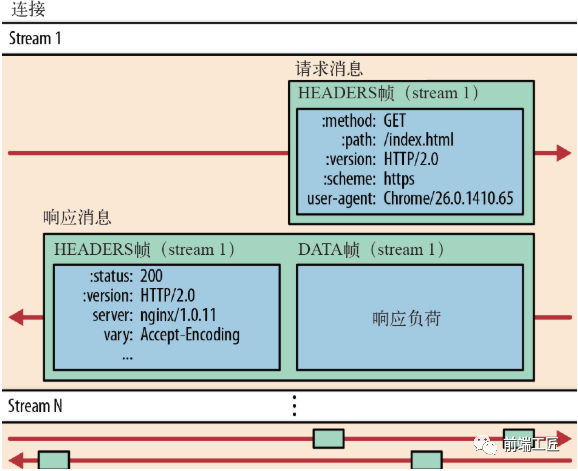
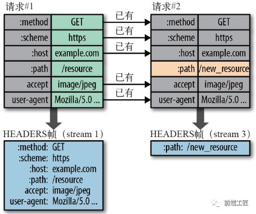
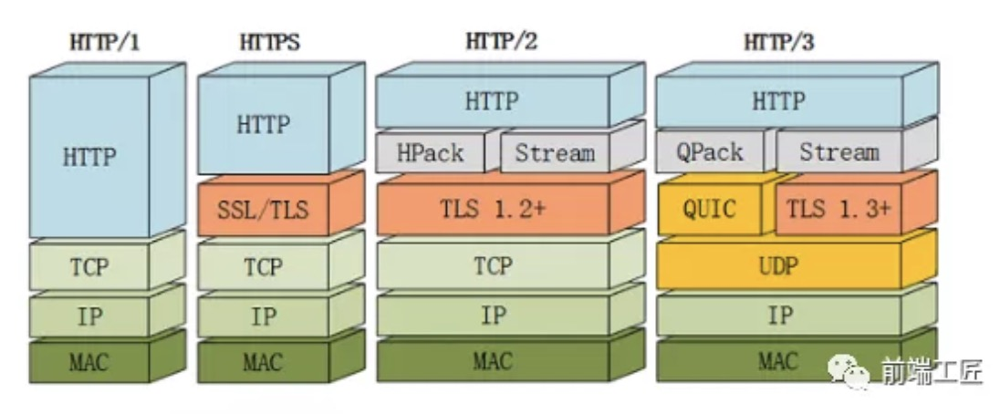

# HTTP2

HTTP 2.0 相比于 HTTP 1.X，可以说是大幅度提高了 web 的性能。HTTP/2 基于 SPDY，专注于性能，最大的一个目标是在用户和网站间只用一个连接（connection）

HTTP2 采用`二进制格式传输`，取代了 HTTP1.x 的文本格式，二进制格式解析更高效。采用`多路复用`代替了 HTTP1.x 的序列和阻塞机制，所有的相同域名请求都通过同一个 TCP 连接并发完成。

## HTTP/1.1 的缺陷

### 1.高延迟--带来页面加载速度的降低

虽然近几年来网络带宽增长非常快，然而我们却并没有看到网络延迟有对应程度的降低。网络延迟问题主要由于队头阻塞`(Head-Of-Line Blocking)`,导致带宽无法被充分利用。

队头阻塞是指当顺序发送的请求序列中的一个请求因为某种原因被阻塞时，在后面排队的所有请求也一并被阻塞，会导致客户端迟迟收不到数据。针对队头阻塞,人们*尝试过以下办法来解决*:

1. 将同一页面的资源分散到不同域名下，提升连接上限。 Chrome 有个机制，**对于同一个域名，默认允许同时建立 6 个 TCP 持久连接**，使用持久连接时，虽然能公用一个 TCP 管道，但是在一个管道中同一时刻只能处理一个请求，在当前的请求没有结束之前，其他的请求只能处于阻塞状态。另外如果在同一个域名下同时有 10 个请求发生，那么其中 4 个请求会进入排队等待状态，直至进行中的请求完成。

2. 雪碧图(Spriting)合并多张小图为一张大图,再用 JavaScript 或者 CSS 将小图重新“切割”出来的技术。

3. 内联(Inlining)是另外一种防止发送很多小图请求的技巧，将图片的原始数据嵌使用 SVG 或 base64 等方式直接存储在代码中，减少网络请求次数。

4. 拼接(Concatenation)将多个体积较小的 JavaScript 使用 webpack 等工具打包成 1 个体积更大的 JavaScript 文件,但如果其中 1 个文件的改动就会导致大量数据被重新下载多个文件。

### 2.无状态特性--带来的巨大 HTTP 头部

由于报文 Header 一般会携带`"User Agent"` `"Cookie"` `"Accept"` `"Server"`等许多固定的头字段（如下图），多达几百字节甚至上千字节，但 Body 却经常只有几十字节（比如 GET 请求、
204/301/304 响应），成了不折不扣的“大头儿子”。Header 里携带的内容过大，在一定程度上增加了传输的成本。更要命的是，每次网络请求响应报文里有很多字段值都是重复的，非常浪费。

### 3.明文传输--带来的不安全性

HTTP/1.1 在传输数据时，所有传输的内容都是明文，客户端和服务器端都无法验证对方的身份，这在一定程度上无法保证数据的安全性。

你有没有听说过"免费 WiFi 陷阱”之类的新闻呢？
黑客就是利用了 HTTP 明文传输的缺点，在公共场所架设一个 WiFi 热点开始“钓鱼”，诱骗网民上网。一旦你连上了这个 WiFi 热点，所有的流量都会被截获保存，里面如果有银行卡号、网站密码等敏感信息的话那就危险了，黑客拿到了这些数据就可以冒充你为所欲为。

## HTTP/2 特性

### 二进制传输

HTTP 2.0 中所有加强性能的核心点在于此。在之前的 HTTP 版本中，我们是通过文本的方式传输数据。在 HTTP 2.0 中引入了新的编码机制，所有传输的数据都会被分割，并采用二进制格式编码，二进制协议解析起来也更高效。

它把 TCP 协议的部分特性挪到了应用层，把原来的"Header+Body"的消息"打散"为数个小片的二进制"帧"(Frame), **用"HEADERS"帧存放头数据、"DATA"帧存放实体数据**。HTTP/2 数据分帧后"Header+Body"的报文结构就完全消失了，协议看到的只是一个个的"碎片"。

HTTP/2 中，同域名下所有通信都在单个连接上完成，该连接可以承载任意数量的双向数据流。每个数据流都以消息的形式发送，而消息又由一个或多个帧组成。多个帧之间可以乱序发送，根据帧首部的流标识可以重新组装。

### Header 压缩

在 HTTP 1.X 中，我们使用文本的形式传输 header，在 header 携带 cookie 的情况下，可能每次都需要重复传输几百到几千的字节。

在 HTTP 2.0 中，使用了 HPACK 压缩格式对传输的 header 进行编码，客户端和服务器两端建立“字典”，用索引号表示重复的字符串，还采用哈夫曼编码来压缩整数和字符串，可以达到 50%~90%的高压缩率

在客户端和服务器端使用“首部表”来跟踪和存储之前发送的 header 键-值对，后面在传输过程中就可以传输已经记录过的 header 的键名，对端收到数据后就可以通过键名找到对应的值。

// TODO- https://mp.weixin.qq.com/s/XVaQH7vE4YOuZyYgS6aGQg

### 多路复用

HTTP1.x 中，并发多个请求需要多个 TCP 连接，浏览器为了控制资源会有 6-8 个 TCP 连接都限制。
HTTP2 中：

- 同域名下所有通信都在单个连接上完成，消除了因多个 TCP 连接而带来的延时和内存消耗
- 单个连接可以承载任意数量的双向数据流（请求和响应）
- 数据流以消息的形式发送，而消息又由一个或多个帧组成，多个帧之间可以乱序发送，因为根据帧首部的流标识可以重新组装。

帧（frame）和流（stream）

- 帧代表着最小的数据单位，每个帧会标识出该帧属于哪个流，流也就是多个帧组成的数据流。

**多路复用，就是在一个 TCP 连接中可以存在多条流。** 换句话说，也就是可以发送多个请求，对端可以通过帧中的标识知道属于哪个请求。通过这个技术，可以避免 HTTP 旧版本中的队头阻塞问题，极大的提高传输性能。

### 服务端 Push

在 HTTP 2.0 中，服务端可以在客户端某个请求后，主动推送其他资源。比如，在浏览器刚请求 HTML 的时候就提前把可能会用到的 JS、CSS 文件发给客户端，减少等待的延迟，这被称为"服务器推送"（ Server Push，也叫 Cache push）

提前给客户端推送必要的资源，这样就可以相对减少一点延迟时间。服务端可以主动推送，客户端也有权利选择是否接收。如果服务端推送的资源已经被浏览器缓存过，浏览器可以通过发送 RST_STREAM 帧来拒收。主动推送也遵守同源策略，换句话说，服务器不能随便将第三方资源推送给客户端，而必须是经过双方确认才行。

### 提高安全性

但由于 HTTPS 已经是大势所趋，而且主流的浏览器 Chrome、Firefox 等都公开宣布只支持加密的 HTTP/2，**所以“事实上”的 HTTP/2 是加密的**。也就是说，互联网上通常所能见到的 HTTP/2 都是使用"https”协议名，跑在 TLS 上面。

HTTP/2 协议定义了两个字符串标识符：“h2"表示加密的 HTTP/2，“h2c”表示明文的 HTTP/2。

## HTTP/3 新特性

### HTTP/2 的缺点

虽然 HTTP/2 解决了很多之前旧版本的问题，但是它还是存在一个巨大的问题，主要是底层支撑的 TCP 协议造成的。HTTP/2 的缺点主要有以下几点：

#### TCP 以及 TCP+TLS 建立连接的延时

HTTP/2 都是使用 TCP 协议来传输的，而如果使用 HTTPS 的话，还需要使用 TLS 协议进行安全传输，而使用 TLS 也需要一个握手过程，这样就需要有两个握手延迟过程：

1. 在建立 TCP 连接的时候，需要和服务器进行三次握手来确认连接成功，也就是说需要在消耗完 1.5 个 RTT 之后才能进行数据传输。

2. 进行 TLS 连接，TLS 有两个版本——TLS1.2 和 TLS1.3，每个版本建立连接所花的时间不同，大致是需要 1~2 个 RTT。

总之，在传输数据之前，我们需要花掉 3 ～ 4 个 RTT。

#### TCP 的队头阻塞并没有彻底解决

在 HTTP/2 中，多个请求是跑在一个 TCP 管道中的。但当出现了丢包时，HTTP/2 的表现反倒不如 HTTP/1 了。因为 TCP 为了保证可靠传输，有个特别的“丢包重传”机制，丢失的包必须要等待重新传输确认，HTTP/2 出现丢包时，整个 TCP 都要开始等待重传，那么就会阻塞该 TCP 连接中的所有请求。而对于 HTTP/1.1 来说，可以开启多个 TCP 连接，出现这种情况反到只会影响其中一个连接，剩余的 TCP 连接还可以正常传输数据。

### HTTP/3 简介

Google 在推 SPDY 的时候就已经意识到了这些问题，于是就另起炉灶搞了一个**基于 UDP 协议的“QUIC”协议**，让 HTTP 跑在 QUIC 上而不是 TCP 上。而这个“HTTP over QUIC”就是 HTTP 协议的下一个大版本，HTTP/3。它在 HTTP/2 的基础上又实现了质的飞跃，真正“完美”地解决了“队头阻塞”问题。

### QUIC 新功能

QUIC 基于 UDP，而 UDP 是“无连接”的，根本就不需要“握手”和“挥手”，所以就比 TCP 来得快。此外 QUIC 也实现了可靠传输，保证数据一定能够抵达目的地。它还引入了类似 HTTP/2 的“流”和“多路复用”，单个“流"是有序的，可能会因为丢包而阻塞，但其他“流”不会受到影响。具体来说 QUIC 协议有以下特点：

- 实现了类似 TCP 的流量控制、传输可靠性的功能。

  - 虽然 UDP 不提供可靠性的传输，但 QUIC 在 UDP 的基础之上增加了一层来保证数据可靠性传输。它提供了数据包重传、拥塞控制以及其他一些 TCP 中存在的特性。

- 实现了快速握手功能

  - 由于 QUIC 是基于 UDP 的，所以 QUIC 可以实现使用 0-RTT 或者 1-RTT 来建立连接，这意味着 QUIC 可以用最快的速度来发送和接收数据，这样可以大大提升首次打开页面的速度。0RTT 建连可以说是 QUIC 相比 HTTP2 最大的性能优势。

- 集成了 TLS 加密功能。

  - 目前 QUIC 使用的是 TLS1.3，相较于早期版本 TLS1.3 有更多的优点，其中最重要的一点是减少了握手所花费的 RTT 个数。

- 多路复用，彻底解决 TCP 中队头阻塞的问题

  - 和 TCP 不同，QUIC 实现了在同一物理连接上可以有多个独立的逻辑数据流。实现了数据流的单独传输，就解决了 TCP 中队头阻塞的问题。

## 总结

HTTP/1.1 有两个主要的缺点：安全不足和性能不高。

HTTP/2 完全兼容 HTTP/1，是“更安全的 HTTP、更快的 HTTPS"，头部压缩、多路复用等技术可以充分利用带宽，降低延迟，从而大幅度提高上网体验；

QUIC 是 HTTP/3 中的底层支撑协议，该协议基于 UDP，又取了 TCP 中的精华，实现了即快又可靠的协议。

## 参考文章

https://mp.weixin.qq.com/s/XVaQH7vE4YOuZyYgS6aGQg
