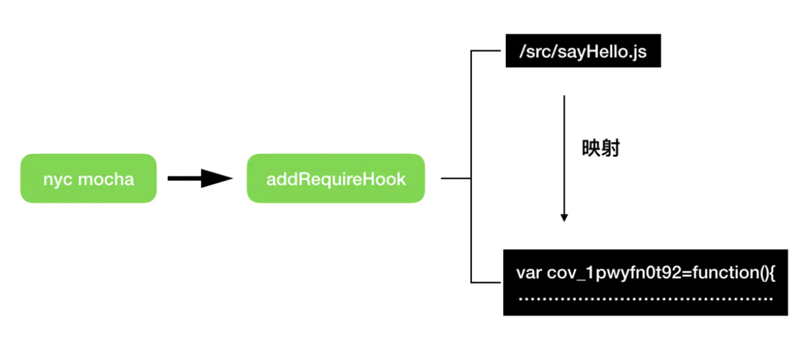

# Istanbul 测试覆盖率的实现原理

Istanbul （伊斯坦布尔）是一个基于 JavaScript 的测试覆盖率统计工具，目前绝大多数测试框架比如 jest mocha 等都是使用 Istanbul 来统计覆盖率的。

### 测试覆盖率的四个维度

- Statements
  - 语句覆盖率，所有语句的执行率；
- Branches
  - 分支覆盖率，所有代码分支如 if、三目运算的执行率；
- Functions
  - 函数覆盖率，所有函数的被调用率；
- Lines
  - 行覆盖率，所有有效代码行的执行率，和语句类似，但是计算方式略有差别；

# Istanbul 的使用

istanbul 最新的版本为： nyc，官方站点为：https://istanbul.js.org，github: https://github.com/istanbuljs/nyc。下面将简称 Istanbul 为 nyc

传统的前端项目测试，假设使用 mocha 测试，我们会执行以下的测试用例：

    `mocha test/suite/\*_/_.spec.js`

接着开发者安装 nyc npm 类库（npm install nyc -D），然后加个 nyc 前缀就会自动 完成运行时的覆盖统计与最终结果展现；

```
// nyc 无参数的默认用法
nyc mocha test/suite/**/\*.spec.js
// nyc 携带参数：html 格式
nyc --reporter=html mocha test/suite/**/\*.spec.js
// 也可以通过项目根目录增加配置文件（如：nyc.config.js）的形式，然后执行上面的命令
module.exports = {
reporter: ['html']
}
```

该命令执行时，会依次完成以下几件事：

1. 将项目 src 源码目录中的 JS 文件做转换并缓存起来；

2. 接着将后面的 mocha 参数放到子进程（child_process）执行，即：调用 mocha 执行测试用例；

3. 测试用例中所测试的 src 源码文件实际是上面的缓存文件，期间完成的语句与分支执行的统计，记录在 JS 内存的某个变量中；

4. 子进程的测试用例执行结束之后，将统计数据发送给 nyc 命令所在线程并保存到文件，默认目录名为：.nyc_output，它记录了本次测试的代码覆盖最完整的数据；

5. nyc 线程内部调用 report 方法，完成从原始数据到可读性良好的内容转换；它会将 .nyc_output 目录中的数据读取出来，并使用 html 格式 进行转换，并默认生成在目录 coverage 下；

### 原理思路

通过对源代码进行 AST 级别的包装重写，将源码转换为 AST 的 IR（Intermediate Representation），然后逐个语法的遍历并包装，记录调用频次与实际值，最后将其还原为最终 JS 代码；

这种实现方式在 JS 的其它场景（如：webpack 中 loader/plugin 对代码的检查替换）与其它语言中也很常见，istanbul 也恰恰采用的是这种思路；

Istanbul 的核心任务就是实现对这四个指标的计数器，它的内部实现流程大致可以分为以下三个步骤：

### 第一步：篡改源代码，注入计数器

“装饰器”源码里面称为 instrumenter，是 Istanbul 的核心，它的作用是“装饰”源代码，注入计数器。要往源代码中注入计数器就需要识别代码行、语句和函数等。首先读取指定目录（用户配置）下的源码并一一构造语法树（AST），区分出四个维度的代码段并进行标记。转换使用的是：[babel-parser](https://babeljs.io/docs/en/babel-parser) 插件

看一个直观的例子就明白了，比如待测试的源码文件为：

```js
function AFunctionThatNeverBeCalled() {
  return Math.random() > 0.5 ? true : false;
}
function AFunctionThatWillBeCalled(string) {
  return string;
}
module.exports = function sayHello(name) {
  if (name) {
    return AFunctionThatWillBeCalled("Hello, " + name);
  } else {
    return "Should pass a name";
  }
};
```

经过装饰器的 AST、维度标记等操作处理后，源码就被装饰成了这个样子：

```js
var cov_1pwyfn0t92 = (function () {
  // 此处省略较多的代码，这里面返回的是一个计数器对象，包括 AST 解析数据等，详见下文
})();
function AFunctionThatNeverBeCalled() {
  cov_1pwyfn0t92.f[0]++;
  cov_1pwyfn0t92.s[0]++;
  return Math.random() > 0.2
    ? (cov_1pwyfn0t92.b[0][0]++, true)
    : (cov_1pwyfn0t92.b[0][1]++, false);
}
function AFunctionThatWillBeCalled(string) {
  cov_1pwyfn0t92.f[1]++;
  cov_1pwyfn0t92.s[1]++;
  return string;
}
cov_1pwyfn0t92.s[2]++;
module.exports = function sayHello(name) {
  cov_1pwyfn0t92.f[2]++;
  cov_1pwyfn0t92.s[3]++;
  if (name) {
    cov_1pwyfn0t92.b[1][0]++;
    cov_1pwyfn0t92.s[4]++;
    return AFunctionThatWillBeCalled("Hello, " + name);
  } else {
    cov_1pwyfn0t92.b[1][1]++;
    cov_1pwyfn0t92.s[5]++;
    return "Should pass a name";
  }
};
```

最开始的源代码几乎被转换成了另一个样子，但原来的代码逻辑是不会改变的，只是**注入了一些对原代码执行没有影响的计数语句**，很明显这些计数代码就对应了各个维度的计数器

| 文件名           | 对应计数器       |
| ---------------- | ---------------- |
| cov_1pwyfn0t92   | 文件唯一计数对象 |
| cov_1pwyfn0t92.s | Statement 计数器 |
| cov_1pwyfn0t92.b | Branch 计数器    |
| cov_1pwyfn0t92.f | Function 计数器  |

发现缺少了行覆盖率指标 Lines 计数器，其实行覆盖率是通过语句中的起始行和结束行之间语句的执行率计算得来的。

### 第二步：拦截模块加载器

但是实际上总不能真的把源码给改了，那么 Istanbul 是如何让测试用例引用的源代码变成自己篡改过的代码呢？

当单元测试框架（jest、mocha 等）开始跑（执行）测试用例的时候，只要把当前运行时的模块加载器要加载的源代码拦截掉，换成 Istanbul 装饰过的代码即可，也就是对测试用例所引用到的源代码进行“偷梁换柱”：



Istanbul 实现 addRequireHook 方法是用了一个 npm 模块 append-transform，大致原理就是类似 nodejs 的 require.extensions 和增加一些特殊处理，具体的细节就不详述了，这里只需要知道它起到了拦截加载器的作用。

### 第三步：统计和输出覆盖率报告

经过了前面的步骤，已经篡改了源代码并注入计数器，那么执行完测试用例后再去收集每一个文件的四个指标覆盖率就水到渠成了，最后拿到结果就可以输出直观的统计报告。

参考： https://juejin.im/post/6844903893403435022
