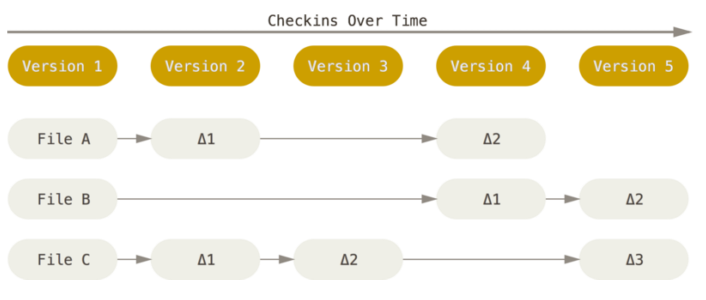
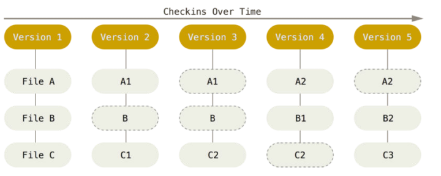
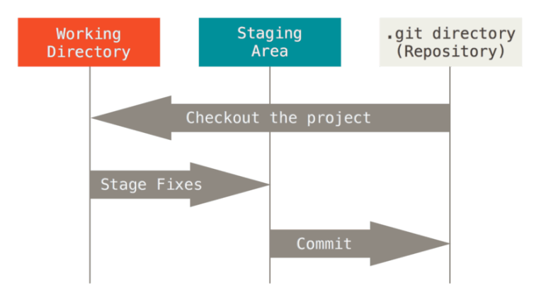
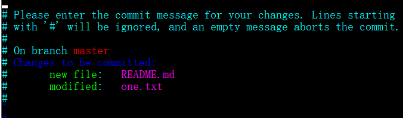

# Git

### Git 快照

> Every time you commit, or save the state of your project in Git, it basically takes a picture of what all your files look like at that moment and stores a reference to that snapshot.

Git 更像是把数据看作是对小型文件系统的一组快照。 每次你提交更新，或在 Git 中保存项目状态时，它主要对当时的全部文件制作一个快照并保存这个快照的索引。 为了高效，如果文件没有修改，Git 不再重新存储该文件，而是只保留一个链接指向之前存储的文件。 Git 对待数据更像是一个快照流。

> In computer systems, a snapshot is the state of a system at a particular point in time.

记录差异


记录快照


### 三种状态

- 已提交 committed
- 已暂存 staged
- 已修改 modified

### 三个区域

- Git 仓库
  - 是 Git 用来保存项目的元数据和对象数据库的地方。 这是 Git 中最重要的部分，从其它计算机克隆仓库时，拷贝的就是这里的数据。
- 暂存区域
  - 暂存区域是一个文件，保存了下次将提交的文件列表信息，一般在 Git 仓库目录中。 有时候也被称作`‘索引’'，不过一般说法还是叫暂存区域。
- 工作目录
  - 工作目录是对项目的某个版本独立提取出来的内容。 这些从 Git 仓库的压缩数据库中提取出来的文件，放在磁盘上供你使用或修改。



### 基本的 Git 工作流程

1. 在工作目录修改文件
2. 暂存文件，将文件的快照放入暂存区
3. 提交更新，找到暂存去文件，将快照永久性存储到 Git 仓库目录。

### 用户信息

当安装完 Git 应该做的第一件事就是设置你的用户名称与邮件地址。 这样做很重要，因为每一个 Git 的提交都会使用这些信息，并且它会写入到你的每一次提交中，不可更改。

```
git config --global user.name "huyaocode"
git config --global user.email johndoe@example.com
```

### 加入暂存区

```
git add 文件名或路径
```

### 忽略文件

创建一个`.gitignore`文件，可描述需要忽略的文件。 参考

```py
# no .a files
*.a
# but do track lib.a, even though you're ignoring .a files above
!lib.a
# 只忽略当前文件夹下已 TODO 为名的文件
/TODO
# 忽略当前目录下 build 这个文件夹
build/
# ignore doc/notes.txt, but not doc/server/arch.txt
doc/*.txt
# ignore all .pdf files in the doc/ directory
doc/**/*.pdf
```

### 状态修改

`git status -s`将每个修改状态以一行展示，也可以用`git status`多行展示。

- `A` 新添加到暂存区中的文件
- `M` 修改过的文件
- `D` 被删除的文件
- `MM` 出现在右边的 M 表示该文件被修改了但是还没放入暂存区，出现在靠左边的 M 表示该文件被修改了并放入了暂存区。
- `??` 未跟踪

### 查看修改

- 要查看尚未暂存的文件更新了哪些部分，不加参数直接输入 `git diff`
- 要查看已暂存的将要添加到下次提交里的内容，可以用 `git diff --cached` 或 `git diff --staged`

### 提交修改

运行`git commit`，会出现如下情况。这种方式会启动文本编辑器，开头还有一空行，供你输入提交说明。下面的行是被注释了的，也可以取消这些注释。

一般是 vim 或 emacs。当然也可以按照 起步 介绍的方式，使用 `git config --global core.editor` 命令设定你喜欢的编辑软件。



也可以使用`git commit -m "修改描述"` 这种直接输入描述的方式提交修改。

`git commit` 加上 `-a` 选项，Git 就会自动把所有已经跟踪过的文件暂存起来一并提交，从而跳过 git add 步骤

### 移除文件

要从 Git 中移除某个文件，就必须要从已跟踪文件清单中移除（确切地说，是从暂存区域移除），然后提交。
可以用 git rm 命令完成此项工作，并连带从工作目录中删除指定的文件，这样以后就不会出现在未跟踪文件清单中了。

运行 `git rm`记录此次移除文件的操作。下一次提交时，该文件就不再纳入版本管理了。 如果删除之前修改过并且已经放到暂存区域的话，则必须要用强制删除选项 `-f`（译注：即 force 的首字母）。 这是一种安全特性，用于防止误删还没有添加到快照的数据，
这样的数据不能被 Git 恢复。

想把文件从 Git 仓库中删除（亦即从暂存区域移除），但仍然希望保留在当前工作目录中。(不想让 Git 跟踪)

```
git rm --cached 某文件
```

### 文件更名

```
git mv file_from file_to
```

其实，运行 git mv 就相当于运行了下面三条命令：

```
mv README.md README
git rm README.md
git add README
```

### 查看提交历史

`git log`git log 会按提交时间列出所有的更新，最近的更新排在最上面。 正如你所看到的，这个命令会列出每个提交的 SHA-1 校验和、作者的名字和电子邮件地址、提交时间以及提交说明。

使用 `-p` 用来限制展示条数。`git log -p -2`

使用 `--stat` 选项看到每次提

使用`format`，定制要显示的记录格式。

使用`--graph`可形象地展示你的分支、合并历史。

```
$ git log --pretty=format:"%h %s" --graph
* 2d3acf9 ignore errors from SIGCHLD on trap
* 5e3ee11 Merge branch 'master' of git://github.com/dustin/grit
|\
| * 420eac9 Added a method for getting the current branch.
* | 30e367c timeout code and tests
* | 5a09431 add timeout protection to grit
* | e1193f8 support for heads with slashes in them
|/
* d6016bc require time for xmlschema
* 11d191e Merge branch 'defunkt' into local
```

### 重新提交

有时候我们提交完了才发现漏掉了几个文件没有添加，或者提交信息写错了。 此时，可以运行带有 `--amend` 选项的提交命令尝试重新提交。

```
git commit --amend
```

这个命令会将暂存区中的文件提交。 如果自上次提交以来你还未做任何修改（例如，在上次提交后马上执行了此命令），那么快照会保持不变，而你所修改的只是提交信息。

文本编辑器启动后，可以看到之前的提交信息。 编辑后保存会覆盖原来的提交信息。

例如，你提交后发现忘记了暂存某些需要的修改，可以像下面这样操作：

```
git commit -m 'initial commit'
git add forgotten_file
git commit --amend
```

最终你只会有一个提交 - 第二次提交将代替第一次提交的结果。

### 取消暂存的文件

使用 `git reset HEAD <file>` 来取消暂存。在调用时加上 --hard 选项可以令 git reset 成为一个危险的命令（译注：可能导致工作目录中所有当前进度丢失！）

### 撤消对文件的修改

使用`git checkout -- <file>` 可以撤销修改（未保存到暂存区）

### 远程仓库

- 添加远程仓库
  - `git remote add <shortname> <url>`
- 从远程仓库中抓取与拉取
  - `git fetch [remote-name]`
- 推送到远程仓库
  - `git push [remote-name] [branch-name]`
- 查看远程仓库
  - `git remote show [remote-name]`
- 远程仓库的重命名
  - `git remote rename`

### 打标签

Git 可以给历史中的某一个提交打上标签，以示重要。

Git 使用两种主要类型的标签：轻量标签（lightweight）与附注标签（annotated）。通常建议创建附注标签。

- 一个轻量标签很像一个不会改变的分支 - 它只是一个特定提交的引用。
- 附注标签是存储在 Git 数据库中的一个完整对象。 它们是可以被校验的；其中包含打标签者的名字、电子邮件地址、日期时间；还有一个标签信息；并且可以使用 GNU Privacy Guard （GPG）签名与验证。

列出标签`git tag`

附注标签

- 创建
  - `git tag -a v1.4 -m '描述'`
- 查看某版本
  - `git show 版本号`

轻量标签

- 轻量标签本质上是将提交校验和存储到一个文件中 - 没有保存任何其他信息，不些描述
- `git tag v1.4-lw`

共享标签

- 默认情况下，git push 命令并不会传送标签到远程仓库服务器上。创建完标签后你必须显式地推送标签到共享服务器上。 这个过程就像共享远程分支一样 - 你可以运行 `git push origin [tagname]`。
- 如果想要一次性推送很多标签，也可以使用带有 --tags 选项的 git push 命令。 这将会把所有不在远程仓库服务器上的标签全部传送到那里。

删除标签

- 删本地，并不会从任何远程仓库中移除这个标签
  - `git tag -d <tagname>`
- 删远程
  - `git push <remote> :refs/tags/<tagname>`

### Git 别名

可为一些操作器别名，例如： `git config --global alias.last 'log -1 HEAD'`后， 使用`git last` 就可以看到最后一次提交
