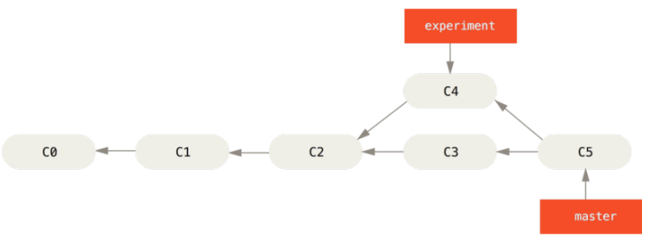
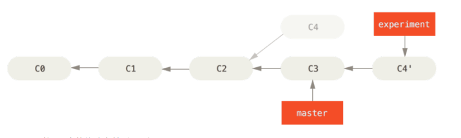
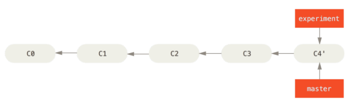

# Git 分支

在进行提交操作时，Git 会保存一个提交对象（commit object）。

假设现在有一个工作目录，里面包含了三个将要被暂存和提交的文件。 暂存操作会为每一个文件计算校验和（使用 SHA-1 哈希算法），然后会把当前版本的文件快照保存到 Git 仓库中（Git 使用 **blob 对象**来保存它们），最终将校验和加入到暂存区域等待提。

当使用 git commit 进行提交操作时，Git 会先计算每一个子目录（本例中只有项目根目录）的校验和，然后在Git 仓库中这些校验和保存为**树对象**。 随后，Git 便会创建一个**提交对象**，它除了包含上面提到的那些信息外，还包含指向这个树对象（项目根目录）的指针。如此一来，Git 就可以在需要的时候重现此次保存的快照。


常用操作
 - 创建分支
   - `git branch testing` 
   - 创建分支后，有一个名为 HEAD 的特殊指针指向当前所在的分支。
 - 分支切换
   - `git checkout testing` 让`HEAD`自己指针指向testing
   - 如果在某分支修改了没有提交然后就切换分支，会有失败并有提示
 - 查看当前所处分支和各分支名
   - `git branch`
 - 查看分支交叉情况
   - `git log --oneline --decorate --graph --all`
 - 删除分支
   - `git branch -d hotfix`
 - 分支合并
   - 切换到想要合并到的分支，将目标分支合并进来
   - `git merge iss53`
 - 查看每一个分支的最后一个提交
   - `git branch -v`
 - 查看哪些分支 已经/没有 合并到当前分支
   - `git branch --merged`
   - `git branch --no-merged`


### 合并冲突
分支创建后，主分支与分出去的分支都修改了同一个地方。
```
CONFLICT (content): Merge conflict in index.html
Automatic merge failed; fix conflicts and then commit the result.
```

此时 Git 做了合并，但是没有自动地创建一个新的合并提交。 Git 会暂停下来，等待你去解决合并产生的冲突。 

使用`git status`可以看到文件处于未合并（unmerged）状态。

任何因包含合并冲突而有待解决的文件，都会以未合并状态标识出来。需要手动解决冲突。看起来像下面这个样子：

```
<<<<<<< HEAD
master branch diff 
=======
hhhhhhhhh 
>>>>>>> testing
```

在你解决了所有文件里的冲突之后，对每个文件使用 `git add` 命令来将其标记为冲突已解决。 **一旦暂存这些原本有冲突的文件，Git 就会将它们标记为冲突已解决。**

再使用`merge`操作提交更新就好。


### 远程分支
远程引用是对远程仓库的引用（指针），包括分支、标签等等。
远程跟踪分支是远程分支状态的引用。 它们是你不能移动的本地引用，当你做任何网络通信操作时，它们会自动移动。 远程跟踪分支像是你上次连接到远程仓库时，那些分支所处状态的书签。

它们以 (remote)/(branch) 形式命名。 例如，如果你想要看你最后一次与远程仓库 origin 通信时 master 分支的状态，你可以查看 origin/master 分支。 你与同事合作解决一个问题并且他们推送了一个 iss53 分支，你可能有自己的本地 iss53 分支；但是在服务器上的分支会指向 origin/iss53 的提交。

 - 查看远程分支
   - `git remote`
 - 同步远程到本地
   - `git fetch origin`
 - 推送
   - `git push （remote） (branch)`
 - `git pull`
   - 在大多数情况下它的含义是一个 git fetch 紧接着一个 git merge 命令。
   - 通常单独显式地使用 fetch 与 merge 命令会更好一些
 - 删除远程分支
   - `git push origin --delete serverfix`


### [变基](https://git-scm.com/book/zh/v2/Git-%E5%88%86%E6%94%AF-%E5%8F%98%E5%9F%BA)
在 Git 中整合来自不同分支的修改主要有两种方法：`merge`以及 `rebase`。

整合分支最容易的方法是 merge 命令。 它会把两个分支的最新快照（C3 和 C4）以及二者最近的共同祖先（C2）进行三方合并，合并的结果是生成一个新的快照（并提交）。


你可以提取在 C4 中引入的补丁和修改，然后在 C3 的基础上应用一次。 在 Git 中，这种操作就叫做 变基。 你可以使用 rebase 命令将提交到某一分支上的所有修改都移至另一分支上，就好像“重新播放”一样。
```
git checkout experiment
git rebase master
```


最后回到 master 分支，进行一次快进合并



它的原理是首先找到这两个分支（即当前分支 experiment、变基操作的目标基底分支 master）的最近共同祖先 C2，然后对比当前分支相对于该祖先的历次提交，提取相应的修改并存为临时文件，然后将当前分支指向目标基底 C3, 最后以此将之前另存为临时文件的修改依序应用。

`merge`和`rebase`这两种整合方法的最终结果没有任何区别，但是变基使得提交历史更加整洁。 你在查看一个经过变基的分支的历史记录时会发现，尽管实际的开发工作是并行的，但它们看上去就像是串行的一样，提交历史是一条直线没有分叉。

#### 变基的风险

**不要对在你的仓库外有副本的分支执行变基。**
如果你已经将提交推送至某个仓库，而其他人也已经从该仓库拉取提交并进行了后续工作，此时，如果你用 git rebase 命令重新整理了提交并再次推送，你的同伴因此将不得不再次将他们手头的工作与你的提交进行整合，如果接下来你还要拉取并整合他们修改过的提交，事情就会变得一团糟。