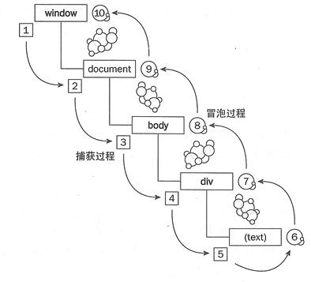

# DOM 

 - DOM 事件的级别
 - DOM 事件模型
 - DOM 事件流
 - DOM 事件捕获的具体流程
 - Event 对象的常见应用
 - 自定义事件

### DOM事件级别
 - DOM0
   - onXXX类型的定义事件
   - element.onclick = function(e) { ... }
 - DOM2
   - addEventListener方式
   - element.addEventListener('click', function (e) { ... })
 - DOM3
   - 增加了很多事件类型
   - element.addEventListener('keyup', function (e) { ... })


### DOM 事件模型
捕获从上到下， 冒泡从下到上。
先捕获，再冒泡



### DOM事件流
DOM标准采用捕获+冒泡。两种事件流都会触发DOM的所有对象，从window对象开始，也在window对象结束。

DOM标准规定事件流包括三个阶段：
 - 事件捕获阶段
 - 处于目标阶段
 - 事件冒泡阶段

### 描述DOM事件捕获的具体流程

从window -> document -> html -> body -> ... -> 目标元素


### Event对象常见应用
 - event.target
   - 触发事件的元素
 - event.currentTarget
   - 绑定事件的元素
 - event.preventDefault()
   - 阻止默认行为
   - event.cancelBubble()和event.preventBubble 都已经废弃
 - event.stopPropagation()
   - 阻止事件冒泡
 - event.stopImmediatePropagation()
   - 阻止事件冒泡并且阻止相同事件的其他侦听器被调用。


### 自定义事件

 - Event
 - CustomEvent

CustomEvent不仅可以用来做自定义事件，还可以在后面跟一个object做参数

```js
var eve = new Event('myEvent');

someDom.addEventListener('myEvent', function() {
  //处理这个自定义事件
});

someDom.dispatchEvent(eve);
```