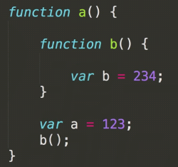
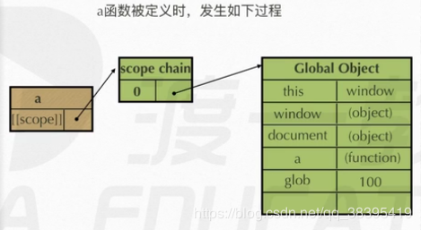
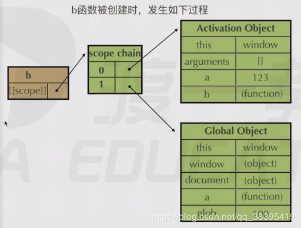
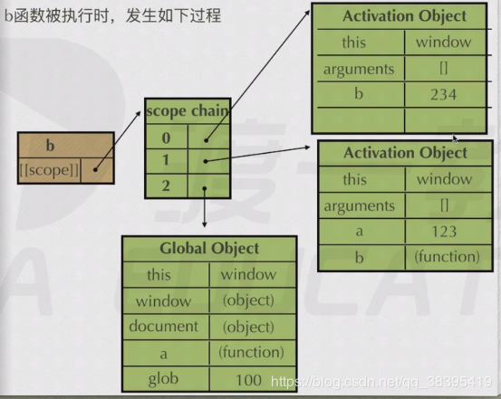
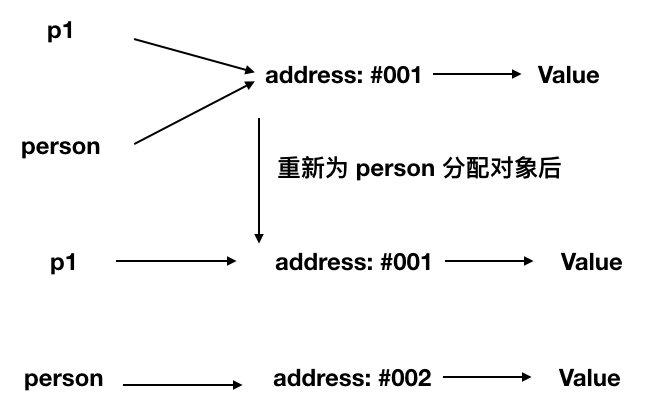

# 函数

### JS 运行分三步：

语法分析（通篇扫描是否有语法错误），预编译（发生在函数执行的前一刻），解释执行（一行行执行）。

### 预编译执行分五步：

一、创建 AO 对象（Activation Object  执行期上下文）

二、找形参和变量声明，将变量和形参名作为 AO 属性名，值为 undefined.
    变量声明提升（变量放到后面也不会报错，只是未定义类型）如：console.log(a);var a=10;结果 undenfined;

三、将实参值和形参统一（传参）

四、在函数体里面找到函数声明{函数声明整体提升（相当于放到程序最前面）}

五、值赋予函数体，执行（声明函数和变量的部分直接不看了）

### 函数作用域[[scope]]

每个 javascript 函数都是一个对象，对象中有的属性可以访问，有的不能，这些属性仅供 javascript 引擎存取，如[[scope]]。

[[scope]]就是函数的作用域，其中存储了执行期上下文的集合。

**执行期上下文**： 当函数执行时，会创建一个称为执行期上下文的内部对象（AO）。一个执行期上下文定义了一个函数执行时的环境，函数每次执行时对应的执行期上下文都是独一无二的，所以多次调用一个函数会导致创建多个执行期上下文，当函数执行完毕，它所产生的执行上下文被销毁。

### 作用域链

`[[scope]]`中所存储的执行期上下文对象的集合，这个集合呈链式链接，我们称这种链式链接为作用域链。查找变量时，要从作用域链的顶部开始查找。Activation Object（AO）到 Global Object（GO）。







### 闭包

当内部函数被保存到外部时，将会生成闭包。生成闭包后，内部函数依旧可以访问其所在的外部函数的变量。

闭包问题的解决方法：立即执行函数、let

详细解释：

当函数执行时，会创建一个称为**执行期上下文的内部对象（AO）**，执行期上下文定义了一个函数执行时的环境。

函数还会获得它所在作用域的**作用域链**，是存储函数能够访问的所有执行期上下文对象的集合，即这个函数中能够访问到的东西都是沿着作用域链向上查找直到全局作用域。

函数每次执行时对应的执行期上下文都是独一无二的，当函数执行完毕，函数都会失去对这个作用域链的引用，JS 的垃圾回收机制是采用引用计数策略，如果一块内存不再被引用了那么这块内存就会被释放。

但是，当闭包存在时，即内部函数保留了对外部变量的引用时，这个作用域链就不会被销毁，此时内部函数依旧可以访问其所在的外部函数的变量，这就是闭包。

先看两个例子，两个例子都打印 5 个 5

```js
for (var i = 0; i < 5; i++) {
  setTimeout(function timer() {
    console.log(i);
  }, i * 100);
}
```

```js
function test() {
  var a = [];
  for (var i = 0; i < 5; i++) {
    a[i] = function () {
      console.log(i);
    };
  }
  return a;
}

var myArr = test();
for (var j = 0; j < 5; j++) {
  myArr[j]();
}
```

解决方法： 使用立即执行函数

```js
for (var i = 0; i < 5; i++) {
  (function (i) {
    setTimeout(function timer() {
      console.log(i);
    }, i * 100);
  })(i);
}
```

```js
function test() {
  var arr = [];
  for (i = 0; i < 10; i++) {
    (function (j) {
      arr[j] = function () {
        console.log(j);
      };
    })(i);
  }
  return arr;
}

var myArr = test();
for (j = 0; j < 10; j++) {
  myArr[j]();
}
```

### 闭包-封装私有变量

```js
function Counter() {
  let count = 0;
  this.plus = function () {
    return ++count;
  };
  this.minus = function () {
    return --count;
  };
  this.getCount = function () {
    return count;
  };
}

const counter = new Counter();
counter.puls();
counter.puls();
console.log(counter.getCount());
```

### 作用域与变量声明提升

- 在 JavaScript 中，函数声明与变量声明会被 JavaScript 引擎隐式地提升到当前作用域的顶部
- 声明语句中的赋值部分并不会被提升，只有名称被提升
- 函数声明的优先级高于变量，如果变量名跟函数名相同且未赋值，则函数声明会覆盖变量声明
- 如果函数有多个同名参数，那么最后一个参数（即使没有定义）会覆盖前面的同名参数

### 构造函数，new 时发生了什么？

```javascript
var obj = {};
obj.__proto__ = Base.prototype;
Base.call(obj);
```

1. 创建一个新的对象 obj;
2. 将这个空对象的**proto**成员指向了 Base 函数对象 prototype 成员对象
3. Base 函数对象的 this 指针替换成 obj, 相当于执行了 Base.call(obj);
4. 如果构造函数显示的返回一个对象，那么则这个实例为这个返回的对象。 否则返回这个新创建的对象

### 函数参数是对象会发生什么问题？

```javascript
function test(person) {
  person.age = 26;
  person = {
    name: "yyy",
    age: 30,
  };

  return person;
}
const p1 = {
  name: "hy",
  age: 25,
};
const p2 = test(p1);
console.log(p1); // -> {name: "hy", age: 26}
console.log(p2); // -> {name: "yyy", age: 30}
```

`person = {}` 这一步操作就将应用与原来的分离了


### JavaScript 中，调用函数有哪几种方式？

- 方法调用模式 Foo.foo(arg1, arg2);
- 函数调用模式 foo(arg1, arg2);
- 构造器调用模式 (new Foo())(arg1, arg2);
- call/apply 调用模式 Foo.foo.call(that, arg1, arg2);
- bind 调用模式 Foo.foo.bind(that)(arg1, arg2)();

### 如何实现一个 new?

```js
function _new(func, ...args) {
  let obj = Object.create(func.prototype); // 原型
  let res = func.apply(obj, args); // 初始化对象属性
  return res instanceof Object ? res : obj; // 返回值
}
```
