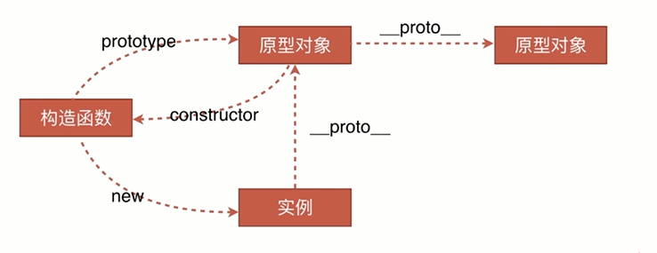

### 创建对象的方法

- 字面量创建
- 构造函数创建
- Object.create()

```js
var o1 = { name: "value" };
var o2 = new Object({ name: "value" });

var M = function () {
  this.name = "o3";
};
var o3 = new M();

var P = { name: "o4" };
var o4 = Object.create(P);
```

### 原型

- JavaScript 的所有对象中都包含了一个 `__proto__` 内部属性，这个属性所对应的就是该对象的原型
- JavaScript 的函数对象，除了原型 `__proto__` 之外，还预置了 prototype 属性
- 当函数对象作为构造函数创建实例时，该 prototype 属性值将被作为实例对象的原型 `__proto__`。



### 原型链

任何一个实例对象通过原型链可以找到它对应的原型对象，原型对象上面的实例和方法都是实例所共享的。

一个对象在查找以一个方法或属性时，他会先在自己的对象上去找，找不到时，他会沿着原型链依次向上查找。

注意： 函数才有 prototype，实例对象只有有**proto**， 而函数有的**proto**是因为函数是 Function 的实例对象

### instanceof 原理

判断实例对象的**proto**属性与构造函数的 prototype 是不是用一个引用。如果不是，他会沿着对象的**proto**向上查找的，直到顶端 Object。

### 判断对象是哪个类的直接实例

使用`对象.construcor`直接可判断

### 构造函数，new 时发生了什么？

```javascript
var obj = {};
obj.__proto__ = Base.prototype;
Base.call(obj);
```

1. 创建一个新的对象 obj;
2. 将这个空对象的**proto**成员指向了 Base 函数对象 prototype 成员对象
3. Base 函数对象的 this 指针替换成 obj, 相当于执行了 Base.call(obj);
4. 如果构造函数显示的返回一个对象，那么则这个实例为这个返回的对象。 否则返回这个新创建的对象

### 类

类的声明

```js
// 普通写法
function Animal() {
  this.name = "name";
}

// ES6
class Animal2 {
  constructor() {
    this.name = "name";
  }
}
```

## 继承

### 借用构造函数法

在构造函数中 使用`Parent.call(this)`的方法继承父类属性。

原理： 将子类的 this 使用父类的构造函数跑一遍

缺点： Parent 原型链上的属性和方法并不会被子类继承

```js
function Parent() {
  this.name = "parent";
}

function Child() {
  Parent.call(this);
  this.type = "child";
}
```

### 原型链实现继承

原理：把子类的 prototype（原型对象）直接设置为父类的实例

缺点：因为子类只进行一次原型更改，所以子类的所有实例保存的是同一个父类的值。
当子类对象上进行值修改时，如果是修改的原始类型的值，那么会在实例上新建这样一个值；
但如果是引用类型的话，他就会去修改子类上唯一一个父类实例里面的这个引用类型，这会影响所有子类实例

```js
function Parent() {
  this.name = "parent";
  this.arr = [1, 2, 3];
}

function Child() {
  this.type = "child";
}

Child.prototype = new Parent();
var c1 = new Child();
var c2 = new Child();
c1.__proto__ === c2.__proto__;
```

### 组合继承方式

组合构造函数中使用 call 继承和原型链继承。

原理： 子类构造函数中使用`Parent.call(this);`的方式可以继承写在父类构造函数中 this 上绑定的各属性和方法；
使用`Child.prototype = new Parent()`的方式可以继承挂在在父类原型上的各属性和方法

缺点： 父类构造函数在子类构造函数中执行了一次，在子类绑定原型时又执行了一次

```js
function Parent() {
  this.name = "parent";
  this.arr = [1, 2, 3];
}

function Child() {
  Parent.call(this);
  this.type = "child";
}

Child.prototype = new Parent();
```

### 组合继承方式 优化 1：

因为这时父类构造函数的方法已经被执行过了，只需要关心原型链上的属性和方法了

```js
Child.prototype = Parent.prototype;
```

缺点：

- 因为原型上有一个属性为`constructor`，此时直接使用父类的 prototype 的话那么会导致 实例的 constructor 为 Parent，即不能区分这个实例对象是 Child 的实例还是父类的实例对象。
- 子类不可直接在 prototype 上添加属性和方法，因为会影响父类的原型

注意：这个时候 instanseof 是可以判断出实例为 Child 的实例的，因为 instanceof 的原理是沿着对象的**proto**判断是否有一个原型是等于该构造函数的原型的。这里把 Child 的原型直接设置为了父类的原型，那么: 实例.**proto** === Child.prototype === Child.prototype

### 组合继承方式 优化 2 - 添加中间对象【最通用版本】：

```js
function Parent() {
  this.name = "parent";
  this.arr = [1, 2, 3];
}

function Child() {
  Parent.call(this);
  this.type = "child";
}

Child.prototype = Object.create(Parent.prototype); //提供__proto__
Child.prototype.constrctor = Child;
```

Object.create()方法创建一个新对象，使用现有的对象来提供新创建的对象的**proto**

### 封装一个原生的继承方法

```js
/**
 * 继承
 * @param Parent
 * @param Child
 */
function extendsClass(Parent, Child) {
  function F() {}
  F.prototype = Parent.prototype;
  Child.prototype = new F();
  Child.prototype.constrctor = Child;
  return Child;
}
```

### [ES5/ES6 的继承除了写法以外还有什么区别？](https://github.com/Advanced-Frontend/Daily-Interview-Question/issues/20)

- class 声明会提升，但不会初始化赋值。Foo 进入暂时性死区，类似于 let、const 声明变量。
- class 声明内部会启用严格模式。
- class 的所有方法（包括静态方法和实例方法）都是不可枚举的。
- class 的所有方法（包括静态方法和实例方法）都没有原型对象 prototype，所以也没有[[construct]]，不能使用 new 来调用。
- 必须使用 new 调用 class。
- class 内部无法重写类名。
