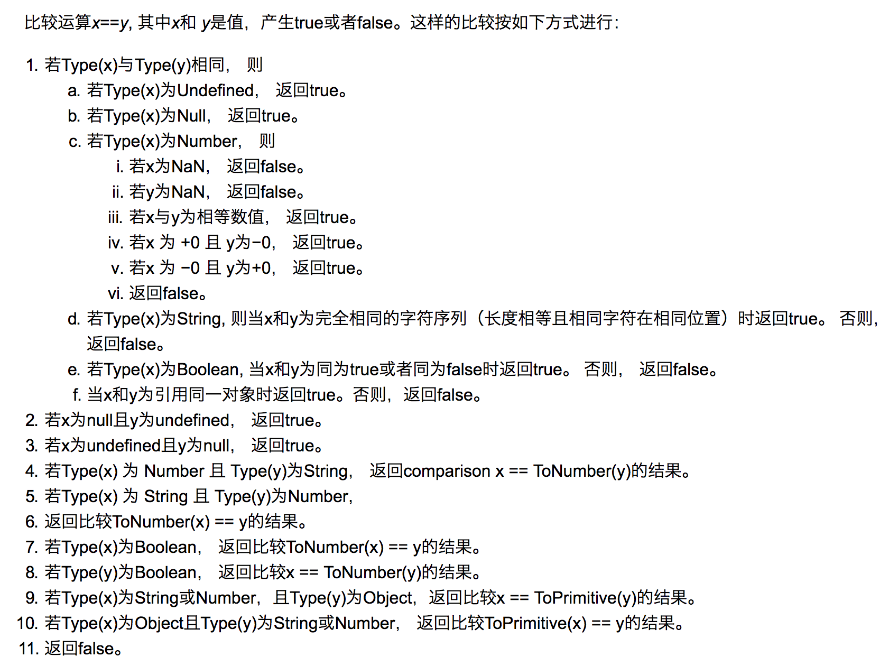

# 变量类型

JS中有7中变量类型。

其中一个奇怪的 null，虽然是基本变量，但是因为设计的时候`null`是全0，而对象是`000`开头，所以有这个误判。

## JS中使用typeof能得到哪些类型？
1. boolean
2. number
3. string
4. undefined
5. symble
6. **object**
7. function

## 实现一个类型判断函数

1. 判断null
2. 判断基础类型
3. 使用`Object.prototype.toString.call(target)`来判断**引用类型**

注意： 一定是使用`call`来调用，不然是判断的Object.prototype的类型
之所以要先判断是否为基本类型是因为：虽然`Object.prototype.toString.call()`能判断出某值是：number/string/boolean，但是其实在包装的时候是把他们先转成了对象然后再判断类型的。 但是JS中包装类型和原始类型还是有差别的，因为对一个包装类型来说，typeof的值是object

```javascript
/**
 * 类型判断
 */
function getType(target) {
  //先处理最特殊的Null
  if(target === null) {
    return 'null';
  }
  //判断是不是基础类型
  const typeOfT = typeof target
  if(typeOfT !== 'object') {
    return typeOfT;
  }
  //肯定是引用类型了
  const template = {
    "[object Object]": "object",
    "[object Array]" : "array",
    "[object Function]": "function",
    // 一些包装类型
    "[object String]": "object - string",
    "[object Number]": "object - number",
    "[object Boolean]": "object - boolean"
  };
  const typeStr = Object.prototype.toString.call(target);
  return template[typeStr];
}
```

# 类型转换

## 转Boolean
以下都为假值，其他所有值都转为 true，包括所有对象（空对象，空数组也转为真）。

 - false
 - undfined
 - null
 - ''
 - NaN
 - 0
 - -0

## 对象转基本类型
对象在转换基本类型时，会调用`valueOf`， 需要转成字符类型时调用`toString`。
```javascript
var a = {
  valueOf() {
    return 0;
  },
  toString() {
    return '1';
  }
}

1 + a           // 1
'1'.concat(a)   //"11"
```
也可以重写 `Symbol.toPrimitive` ，该方法在转基本类型时调用**优先级最高**。  [Symbol.toPrimitive](https://developer.mozilla.org/zh-CN/docs/Web/JavaScript/Reference/Global_Objects/Symbol/toPrimitive) 指将被调用的指定函数值的属性转换为相对应的原始值。


## 类型转换

加法运算时，其中一方是字符串类型，就会把另一个也转为字符串类型。

[JS类型转换规则总结](https://blog.csdn.net/qq_37746973/article/details/82491282)

[JS隐射类型转换](https://blog.csdn.net/qq_37746973/article/details/81010057)


## == 操作符


```javascript
[].toString() -> ''

[] == false

//空对象既不等于true，也不等于false， 但是空对象是真值，空数组也是真值
var a = {};
a == true   //false
a == false  //false
```