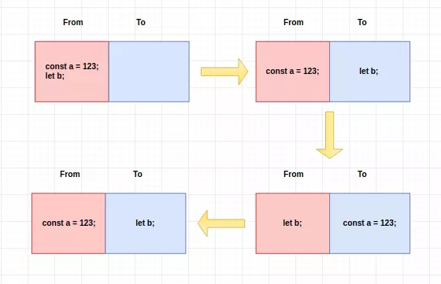

[【V8 引擎】浅析 Chrome V8 引擎中的垃圾回收机制和内存泄露优化策略](https://segmentfault.com/a/1190000019584487)

## 垃圾回收机制

### 如何判断回收内容

如何确定哪些内存需要回收，哪些内存不需要回收，这是垃圾回收期需要解决的最基本问题。我们可以这样假定，**一个对象为活对象当且仅当它被一个根对象 或另一个活对象指向**。根对象永远是活对象，它是被浏览器或 V8 所引用的对象。被局部变量所指向的对象也属于根对象，因为它们所在的作用域对象被视为根对 象。全局对象（Node 中为 global，浏览器中为 window）自然是根对象。浏览器中的 DOM 元素也属于根对象。

### V8 回收策略

新生代的对象为存活时间较短的对象，老生代中的对象为存活时间较长或常驻内存的对象。分别对新生代和老生代使用 不同的垃圾回收算法来提升垃圾回收的效率。对象起初都会被分配到新生代，当新生代中的对象满足某些条件（后面会有介绍）时，会被移动到老生代（晋升）。

### 新生代算法

在新生代空间中，内存空间分为两部分，分别为 From 空间和 To 空间。在这两个空间中，必定有一个空间是使用的，另一个空间是空闲的。新分配的对象会被放入 From 空间中，当 From 空间被占满时，新生代 GC 就会启动了。算法会检查 From 空间中存活的对象并复制到 To 空间中，如果有失活的对象就会销毁。当复制完成后将 From 空间和 To 空间互换，这样 GC 就结束了。

### 老生代算法

老生代中的对象一般存活时间较长且数量也多，使用了两个算法，分别是标记清除算法和标记压缩算法。

在讲算法前，先来说下什么情况下对象会出现在老生代空间中：

1. 新生代中的对象是否已经经历过一次 Scavenge 算法，如果经历过的话，会将对象从新生代空间移到老生代空间中。
2. To 空间的对象占比大小超过 25 %。在这种情况下，为了不影响到内存分配，会将对象从新生代空间移到老生代空间中。

## 内存泄露和优化

### 什么是内存泄露？

存泄露是指程序中已分配的堆内存由于某种原因未释放或者无法释放，造成系统内存的浪费，导致程序运行速度减慢甚至系统奔溃等后果。

### 常见的内存泄露的场景

- 缓存
- 作用域未释放（闭包）
- 没有必要的全局变量
- 无效的 DOM 引用
- 定时器未清除
- 事件监听为空白

### 内存泄露优化

1. 在业务不需要的用到的内部函数，可以重构到函数外，实现解除闭包。
2. 避免创建过多的生命周期较长的对象，或者将对象分解成多个子对象。
3. 避免过多使用闭包。
4. 注意清除定时器和事件监听器。
5. nodejs 中使用 stream 或 buffer 来操作大文件，不会受 nodejs 内存限制。
