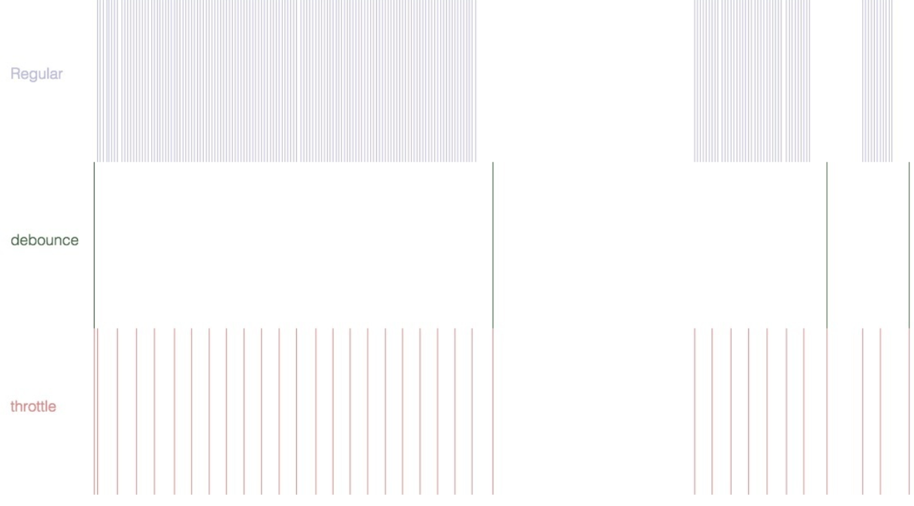

### 防抖 debounce
函数防抖就是在函数需要频繁触发的情况下，只有足够的空闲时间，才执行一次。 

典型应用
 - 百度搜索框在输入稍有停顿时才更新推荐热词。
 - 拖拽

```js
function debounce(handler, delay){

  delay = delay || 300;
  var timer = null;

  return function(){

    var _self = this,
        _args = arguments;

    clearTimeout(timer);
    timer = setTimeout(function(){
      handler.applay(_self, _args);
    }, delay);
  }
}
```


### 节流 throttle
一个函数只有在大于执行周期时才执行，周期内调用不执行。好像水滴积攒到一定程度才会触发一次下落一样。

典型应用： 
 - 抢券时疯狂点击，既要限制次数，又要保证先点先发出请求
 - 窗口调整
 - 页面滚动
```js
function throttle(handler, wait){

  wait = wait || 300;
  var lastTime = 0;

  return function(){
    var _self = this,
    _args = arguments;

    var nowTime = new Date().getTime();
    if(nowTime > lastTime){
      handler.apply(_self, _args);
      lastTime = nowTime;
    }

  }
}
```


### 节流与防抖的本质

以闭包的形式存在，通过对事件对应的回调函数进行包裹、以自由变量的形式缓存时间信息，最后用**定时器**或**时间差**来控制事件的触发频率。



### 浅拷贝
浅拷贝是拷贝第一层的拷贝

使用`Object.assign`解决这个问题。

```js
let a = {
  age: 1
}
let b = Object.assign({}, a)
a.age = 2
console.log(b.age) // 1
```

通过展开运算符 `...` 来实现浅拷贝
```js
let a = {
  age: 1
}
let b = {...a};
a.age = 2;
console.log(b.age)  // 1
```


### 深拷贝
简单的做法：`JSON.parse(JSON.stringfy(obj))`
但是该方法也是有局限性的：
 - 会忽略`undefined`
 - 会忽略`symbol`  
 - 会忽略函数   
 - 不能解决循环引用的对象 （会抱错）

如果你所需拷贝的对象含有内置类型并且不包含函数，可以使用 [`MessageChannel`](https://www.jianshu.com/p/4f07ef18b5d7)


**自封装深拷贝**
思路：
1. 使用for-in遍历对象
2. 因为for-in会遍历原型链上的属性，所以需要判断属性是否在原型链上，不是原型链才拷贝
3. 判断属性值类型是原始类型和引用类型
4. 原始类型直接赋值（注意null）
5. 引用类型判断是对象还是数组，**创建对应的空对象或空数组**，递归调用函数，将值赋值进去

```js
/**
 * 深度克隆
 * @param   origin 被拷贝的原对象
 * @param   target 拷贝出来的对象
 * @return         拷贝出来的对象
 */
function deepClone(origin, target) {
  target = target || {};
  for(let prop in origin) {
    if(origin.hasOwnProperty(prop)) {
      if(typeof(origin[prop]) === 'object' && typeof(origin[prop] !== 'null')) {
        // 先判断是不是数组
        if(origin[prop] instanceof Array) {
          target[prop] = [];
          deepClone(origin[prop], target[prop]);
        }
        target[prop] = {};
        deepClone(origin[prop], target[prop]);
      } 
      else {
        target[prop] = origin[prop];
      }
    }
  }
}
```


### 自封装bind方法

 - 因为bind的使用方法是 某函数.bind(某对象，...剩余参数)
   - 所以需要在Function.prototype 上进行编程
 - 将传递的参数中的某对象和剩余参数使用apply的方式在一个回调函数中执行即可
 - 要在第一层获取到被绑定函数的this，因为要拿到那个函数用apply

```js
/**
 * 简单版本 
 */
Function.prototype.myBind = (that, ...args) => {
  const funcThis = this;
  return function(){
    const _args = Array.prototype.slice.call(arguments);
    return funcThis.apply(that, args.concat(_args));
  }
}
```

```js
/**
 * 自封装bind方法
 * @param  {对象} target [被绑定的this对象， 之后的arguments就是被绑定传入参数]
 * @return {[function]}  [返回一个新函数，这个函数就是被绑定了this的新函数]
 */
Function.prototype.myBind = function (target){
	target = target || window;
	var self = this;
	var args = [].slice.call(arguments, 1);
	var temp = function(){};
	var F = function() {
		var _args = [].slice.call(arguments, 0);
		return self.apply(this instanceof temp ? this: target, args.concat(_args));
	}
	temp.prototype = this.prototype;    //维护原型关系
	F.prototype = new temp();
	return F;
}
 
var obj = {
	value: 1
}
 
function show(name, age){
	console.log(this.value);
	console.log(name, age);
	return name + age + this.value;
}
 
// function FatherShow(){
 
// }
// FatherShow.prototype.lastname = 'haha';
// show.prototype = new FatherShow();
 
var theShow = show.bind(obj, "xioaqin ");
console.log('bind', theShow("huyao ", 20));
 
 
var newShow = show.myBind(obj, "xioaqin ");
console.log('mybind', newShow("huyao ", 20));
// var newShow = show.myBind(obj, 'huyao ');
// var oS = new newShow();
 
// console.log( oS.lastname)
```


### 求一个字符串的字节长度

假设：一个英文字符占用一个字节，一个中文字符占用两个字节

```js
function GetBytes(str){
  var len = str.length;
  var bytes = len;
  for(var i=0; i<len; i++){
    if (str.charCodeAt(i) > 255) bytes++;
  }
  return bytes;
}
alert(GetBytes("你好,as"));
```