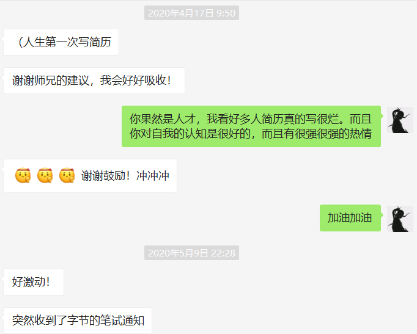
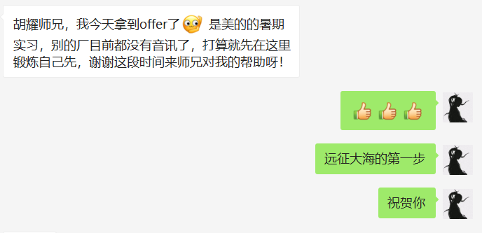
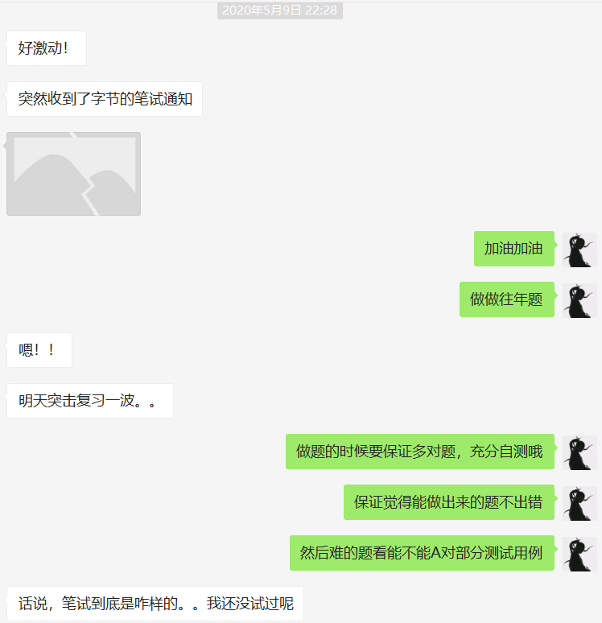
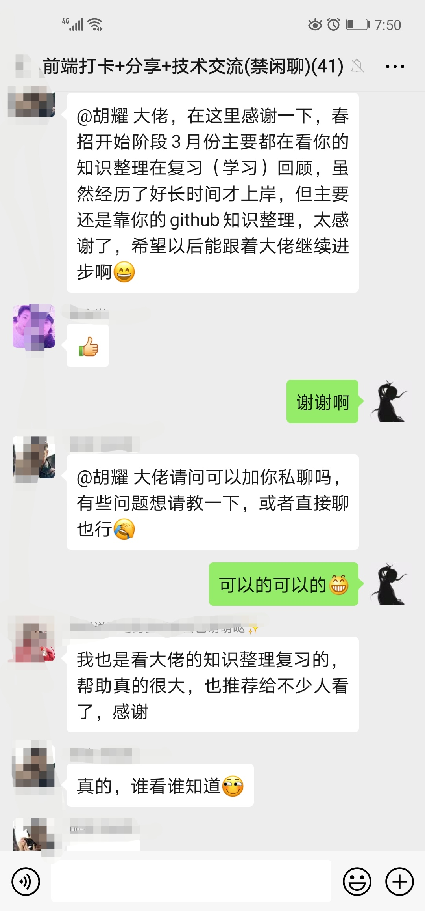
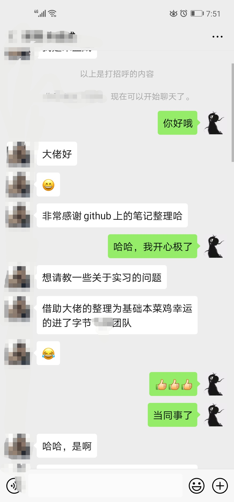

# 前端基础知识总结

github 链接：[webKnowledge](https://github.com/huyaocode/webKnowledge)

这是我平时收集整理的知识点，查漏补缺，扎实基础，更像是一个文档。

**所有内容都在文件夹里，要点进去看。Readme 里面只挂内推**

**star**一个表鼓励，也不容易搞丢链接哦!

有疑问的同学也可以加我**微信**： purple12369

## 前端打卡+学习交流群

## 内推

我现在选择字节跳动啦，欢迎大家投递简历。每一份简历我都会认真的跟到底的。而且我在天府成都工作哦，成都的伙伴们找我是最好的啦。北京也有我的好哥们，核心广告部门。 总之，欢迎投递～

### 内推码

我的**校招内推码： ZKMUXNN**

不过建议你联系我，我亲自帮你内推哦，我帮你内推可以给你写推荐语。

### 前端开发工程师 - 成都 · 全职

https://job.toutiao.com/s/4a4rET

#### 职位要求

1. 3 年及以上 Web 前端开发经验；
2. 良好的设计和编码品味，热爱写代码能产出高质量的设计和代码；
3. 掌握 WEB 前端开发技术: JavaScript(含 ES6)、HTML、CSS、DOM、协议、安全等；
   有良好的产品意识；
4. 积极乐观，认真负责，乐于协作。

### 前端实习生 - 成都 · 实习

https://job.toutiao.com/s/4aP9Ux

#### 职位要求

1. 统招本科及以上学历，2021 届及以后毕业的学生；
2. 良好的设计和编码品味，热爱写代码能产出高质量的设计和代码；
3. 掌握 WEB 前端开发技术: JavaScript(含 ES6)、HTML、CSS、DOM、协议、安全等；
4. 有良好的产品意识；
5. 积极乐观，认真负责，乐于协作。

### 前端开发工程师 - 北京 · 全职

https://job.toutiao.com/s/4ay89f

#### 职位描述

1. 负责产品 Web 前端的实现，协助各产品网页的性能优化；
2. 负责数据平台的可视化，设计或选用前端基础组件，搭建大型网页应用；
3. 尝试更快更灵活的 Webview 新功能或体验优化。

#### 职位要求

1. 本科及以上学历，计算机相关专业；
2. 热爱计算机科学和互联网技术，对各种 Web 前端技术有深刻理解；
3. 关注 Web 发展，对新技术充满激情，期待或者已经开发出优秀的产品；
4. 理解 RIA，有 Ajax 相关的实践经验，对 React.js，VUE.js，Angular.js 等 MVVM 框架能熟练运用至少一种，且了解其基本原理；
5. 对可用性、可访问性等相关知识有实际的了解和实践经验；
6. 熟悉服务器端 Web 应用结构，有服务器端脚本语言经验更佳；
7. 团队精神，性格乐观，能积极面对压力。

## 收的到感谢

满足我的虚荣心，然后也让大家相信文档质量，相信努力会换来收获，我今后把收到的感谢都匿名整理在这里。之前还有好多感谢我都把聊天记录删了，可惜了，我的虚荣心啊~

