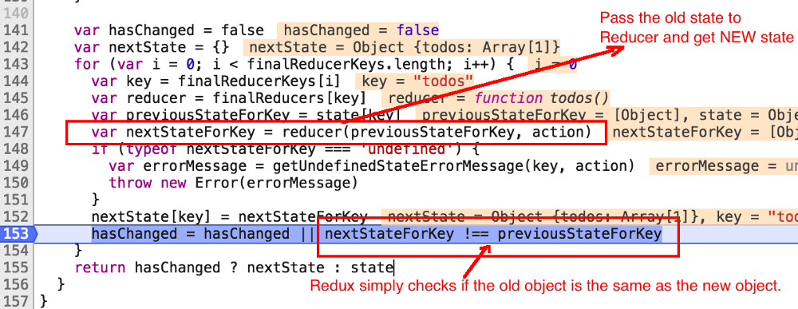

### redux 简介

redux 是一个应用数据流框架，主要是解决了组件间状态共享的问题，原理是集中式管理，主要有三个核心方法，`action，store，reducer`

工作流程是：

- view 用 actionCreator 创建一个 action,里面可能包含一些数据
- 使用 store 的 dispatch 方法将 acion 传入 store
- store 将 action 与旧的 state 转发给 reducer
- reducer 深拷贝 state,并返回一个新的 state 给 store
- store 接收并更新 state
- 使用 store.subscribe 订阅更新,重新 render 组件

### reducer 为什么是纯函数？

从本质上讲，纯函数的定义如下：不修改函数的输入值，依赖于外部状态（比如数据库，DOM 和全局变量），同时对于任何相同的输入有着相同的输出结果。

阅读源码可以看到，Redux 接收一个给定的 state（对象），然后通过循环将 state 的每一部分传递给每个对应的 reducer。如果有发生任何改变，reducer 将返回一个新的对象。如果不发生任何变化，reducer 将返回旧的 state。

Redux 只通过比较新旧两个对象的存储位置来比较新旧两个对象是否相同（也就是 Javascript 对象浅比较）。如果你在 reducer 内部直接修改旧的 state 对象的属性值，那么新的 state 和旧的 state 将都指向同一个对象。因此 Redux 认为没有任何改变，返回的 state 将为旧的 state。

深比较在真实的应用当中代价昂贵，因为通常 js 的对象都很大，同时需要比较的次数很多。

因此一个有效的解决方法是作出一个规定：无论何时发生变化时，开发者都要创建一个新的对象，然后将新对象传递出去。同时，当没有任何变化发生时，开发者发送回旧的对象。也就是说，新的对象代表新的 state。 使用了新的策略之后，你能够比较两个对象通过使用!==比较两个对象的存储位置而不是比较两个对象的所有属性。
