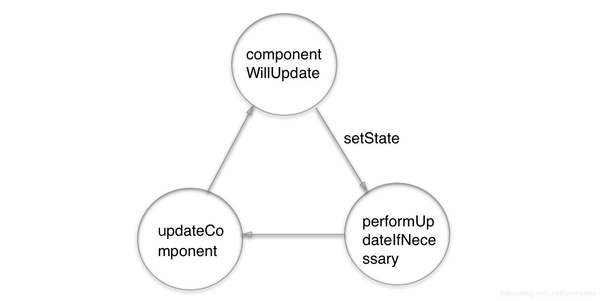

# [深入 setState 机制](https://github.com/sisterAn/blog/issues/26)

### 异步更新

考虑到性能问题，setState 使用一个**队列机制**来更新 state。
当执行 setState 时，会将需要更新的 state**浅合并**后放入状态队列，不会立即更新 state。而如果不使用 setState，而直接修改 state 的值就不会放入状态队列，下一次调用 setState 对状态队列进行更新的时候可能会造成不可预知的错误。

例子：

```js
// 假设 state.count === 0
this.setState({ count: state.count + 1 });
this.setState({ count: state.count + 1 });
this.setState({ count: state.count + 1 });
// state.count === 1, 而不是 3
```

本质上等同于：

```js
// 假设 state.count === 0
Object.assign(
  state,
  { count: state.count + 1 },
  { count: state.count + 1 },
  { count: state.count + 1 }
);
// {count: 1}
```

**解决方法**为： **传递一个签名为 (state, props) => newState 的函数作为参数。** 向 setState 中传入函数时，这个函数不会被浅合并，一定会执行，是一个原子性更新操作。

```js
// 正确用法
this.setState((prevState, props) => ({
  count: prevState.count + props.increment,
}));
```

### setState 循环调用风险

但，如果在`shouldComponentUpdate`或`componentWillUpdate` 方法里调用 this.setState 方法，就会造成崩溃。


### 何时同步？何时异步？

如果是由 React 引发的事件处理（比如通过 onClick 引发的事件处理），调用 setState 不会同步更新 this.state，除此之外的 setState 调用会同步执行 this.state。
所谓“除此之外”，指的是绕过 React 通过 addEventListener 直接添加的事件处理函数，还有通过 setTimeout/setInterval 产生的异步调用。而这一切都是因为一个非常核心的概念--事务

```js
class Example extends React.Component {
  constructor() {
    super();
    this.state = {
      val: 0
    };
  }

  componentDidMount() {
    this.setState({val: this.state.val + 1});
    console.log(this.state.val);    // 第 1 次 log

    this.setState({val: this.state.val + 1});
    console.log(this.state.val);    // 第 2 次 log

    setTimeout(() => {
      this.setState({val: this.state.val + 1});
      console.log(this.state.val);  // 第 3 次 log

      this.setState({val: this.state.val + 1});
      console.log(this.state.val);  // 第 4 次 log
    }, 0);
  }

  render() {
    return null;
  }
};

答案是 0 0 2 3
```
