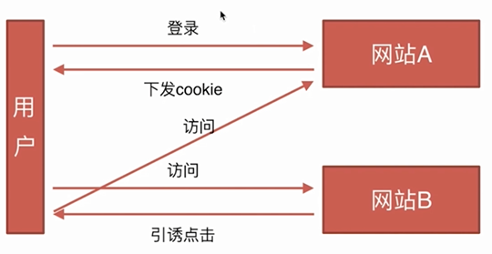

# CSRF 跨站请求伪造

（Cross Site Request Forgy）
打开同一浏览器时其他的网站对本网站造成的影响。原理就是攻击者构造出一个后端请求地址，诱导用户点击或者通过某些途径自动发起请求。如果用户是在登录状态下的话，后端就以为是用户在操作，从而进行相应的逻辑。


举个例子，用户同时打开了 A 网站和钓鱼网站。 假设 A 网站中有一个通过 GET 请求提交用户评论的接口，那么攻击者就可以在钓鱼网站中加入一个图片，图片的地址就是评论接口。

```html

```

## CSRF 攻击原理

1. 用户登录 A 网站
2. A 网站确认身份（给客户端 cookie）
3. B 网站页面向 A 网站发起请求（带上 A 网站身份）

## CSRF 防御

1. Get 请求不对数据进行修改
2. 不让第三方网站访问到用户 Cookie
3. 阻止第三方网站请求接口
4. 请求时附带验证信息，比如验证码或者 Token

- SameSite
  - 可以对 Cookie 设置 SameSite 属性。该属性表示 Cookie 不随着跨域请求发送，可以很大程度减少 CSRF 的攻击，但是该属性目前并不是所有浏览器都兼容。
- Token 验证
  - cookie 是发送时自动带上的，而不会主动带上 Token，所以在每次发送时主动发送 Token
- Referer 验证
  - 对于需要防范 CSRF 的请求，我们可以通过验证 Referer 来判断该请求是否为第三方网站发起的。
- 隐藏令牌
  - 主动在 HTTP 头部中添加令牌信息

禁止第三方网站带 cookies

[same-site](https://developer.mozilla.org/zh-CN/docs/Web/HTTP/Cookies#SameSite_Cookies)属性。 设置只有同一站点的请求才能携带 cookie

## CSRF 蠕虫

如果某个用户打开了被攻击网页，并且用户同时访问了攻击者的网页。
那么攻击者的网页就会使用用户的身份发送一些请求，并且常用用户的身份发布一些评论或文章，里面包含攻击者的网页链接。如果其他用户看到了这个用户的这条评论，都甚至可以不点击，其他用户也会被盗用身份发送一些恶意请求。这样病毒的传播就会越来越快，影响越来越大。

## CSRF 攻击危害

- 利用用户登录态
- 用户不知情
- 完成业务请求
-
- 盗取用户资金
- 冒充用户发帖背锅
- 损坏网站名誉
