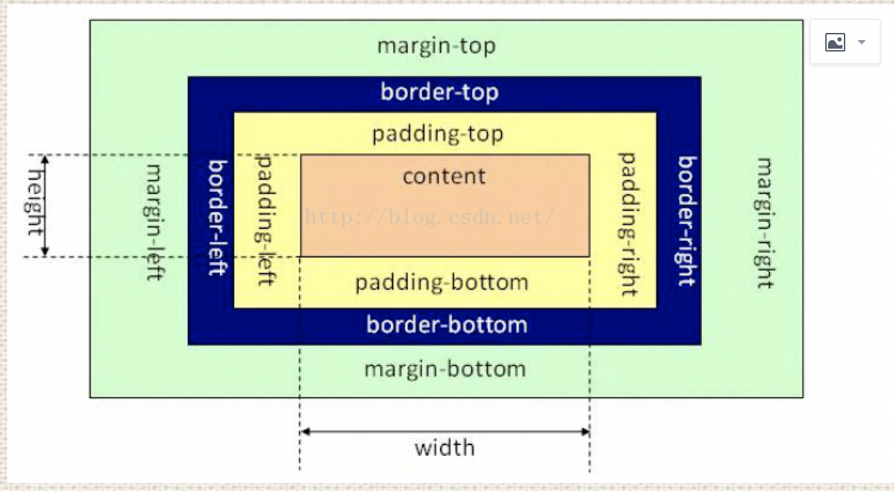
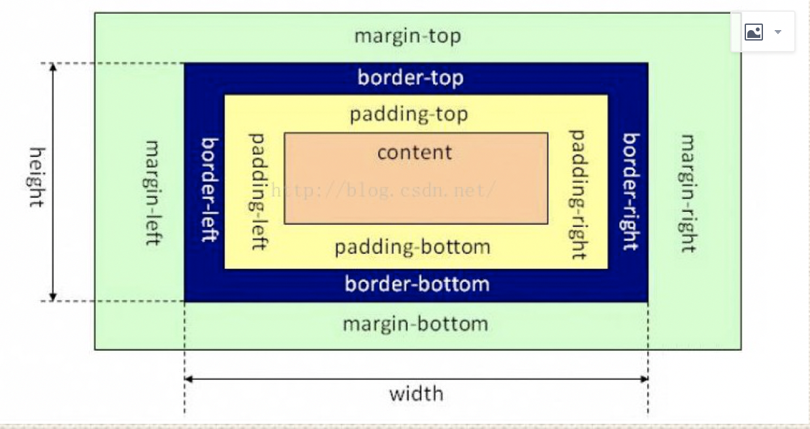
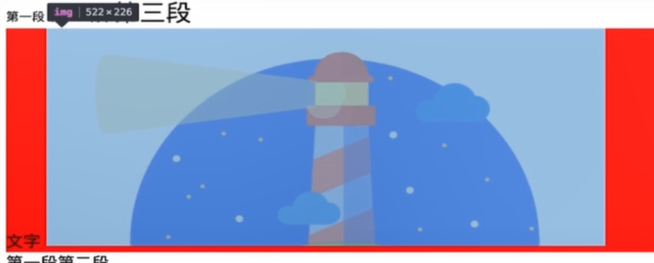
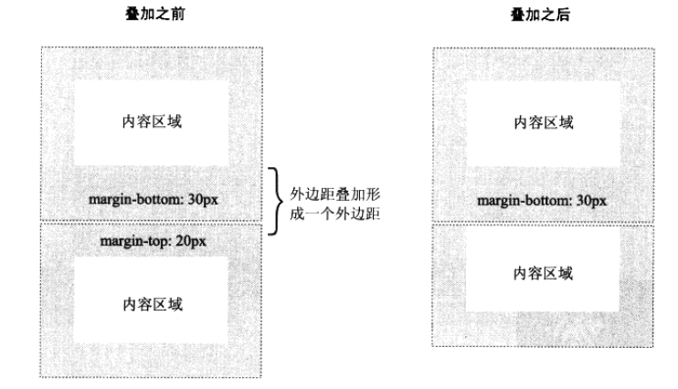
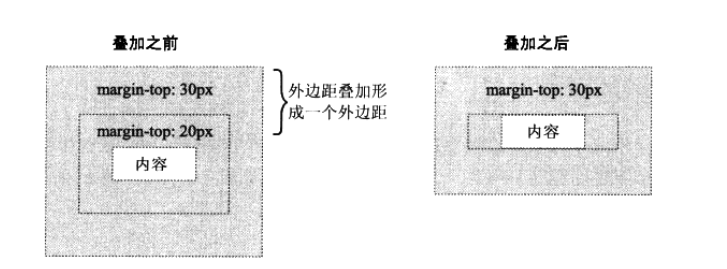
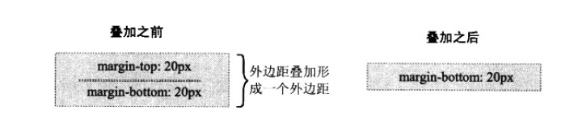
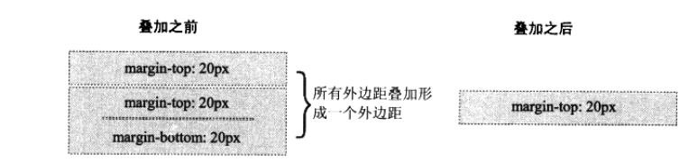

# CSS

Cascading Style Sheet 层叠样式表

### [CSS 选择器](./CSS选择器.md)

### 盒模型

盒模型有两种， IE 怪异盒子模型、W3C 标准盒子模型；

盒模型是由： 内容(content)、内边距(padding)、边框(border)、外边距(margin) 组成的。

标准模型的宽高是指的 content 区宽高；
IE 盒模型的宽高是指的 content+padding+border 的宽高。





### CSS 如何设置这两种盒模型？

标准盒模型：

```
box-sizing: content-box;
```

怪异盒模型：

```
box-sizing: border-box;
```

### BFC

[什么是 BFC](https://www.cnblogs.com/libin-1/p/7098468.html)

W3C 对 BFC 定义：

> 浮动元素和绝对定位元素，非块级盒子的块级容器（例如 inline-blocks, table-cells, 和 table-captions），以及 overflow 值不为“visiable”的块级盒子，都会为他们的内容创建新的 BFC（块级格式上下文）。

BFC(Block formatting context)直译为"块级格式化上下文"。它是一个独立的渲染区域，只有 Block-level box 参与， 它规定了内部的 Block-level Box 如何布局，并且与这个区域外部毫不相干。

BFC 作用：

1. 利用 BFC 避免外边距折叠
2. 清除内部浮动 （撑开高度）
   1. 原理: 触发父 div 的 BFC 属性，使下面的子 div 都处在父 div 的同一个 BFC 区域之内
3. 避免文字环绕
4. 分属于不同的 BFC 时，可以阻止 margin 重叠
5. 多列布局中使用 BFC

如何生成 BFC：（脱离文档流，满足下列的任意一个或多个条件即可）

1. 根元素，即 HTML 元素（最大的一个 BFC）
2. float 的值不为 none
3. position 的值为 absolute 或 fixed
4. overflow 的值不为 visible（默认值。内容不会被修剪，会呈现在元素框之外）
5. display 的值为 inline-block、table-cell、table-caption

BFC 布局规则：

1. 内部的 Box 会在垂直方向，一个接一个地放置。
2. 属于同一个 BFC 的两个相邻的 Box 的 margin 会发生重叠
3. BFC 就是页面上的一个隔离的独立容器，容器里面的子元素不会影响到外面的元素。反之也如此, 文字环绕效果，设置 float
4. BFC 的区域不会与 float box 重叠。
5. 计算 BFC 的高度，浮动元素也参与计算

### BFC、IFC、GFC 和 FFC

- BFC（Block formatting contexts）：块级格式上下文

- IFC（Inline formatting contexts）：内联格式上下文

- GFC（GrideLayout formatting contexts）：网格布局格式化上下文

- FFC（Flex formatting contexts）:自适应格式上下文

### 非布局样式

- 字体、字重、颜色、大小、行高
- 背景、边框
- 滚动、换行
- 粗体、斜体、下划线
- 其他

### 行高的构成

- 行高是由 line-box 组成的
- line-box 是由一行里的 inline-box 组成的
- inline-box 中最高的那个，或字体最大的拿个决定行高

### float

- 元素"浮动"
- 脱离文档流
- 不脱离文本流
- 位置尽量靠上，并靠左或右

对自己的影响

- 形成"块"(BFC)
- 这个块会负责自己的布局，宽高由自己决定

比如 span 中用 float 这个 span 就形成了一个 BFC，就可以设置宽高了

对兄弟元素的影响

- 上面一般贴非 float 元素
- 靠边贴 float 元素或边
- 不影响其他块级元素位置
- 影响其他块级元素文本

对父级元素的影响

- 从布局上"消失"
- 高度塌陷

### 清楚浮动

浮动的元素布局时不会占据父元素的布局空间，即父元素布局时不会管浮动元素，浮动元素有可能超出父元素，从而对其他元素造成影响。

方法一：让父元素变为一个 BFC。
父元素 overflow: auto/hidden。 让父元素去关注里面的高度。
必须定义 width 或 zoom:1，同时不能定义 height，使用 overflow:auto 时，浏览器会自动检查浮动区域的高度

方法二： 使用伪元素清楚浮动

```css
.container::after {
  content: " ";
  clear: both;
  display: block;
  visibility: hidden;
  height: 0;
}
```

### inline-block 的间隙

两个并列的 inline-block 中间会有一条裂缝，这个的原因是两个标签之间有空格，浏览器把这些空格当成文字中空格，所以这两个块中间多少有间隙。

解决办法：

1. 删除两个标签间的空格，但是这样 html 排版不好
2. 容器元素 font-size: 0 然后再在里面再重新设置字体大小

### 你对 line-height 是如何理解的？

- line-height 指一行字的高度，包含了字间距，实际上是下一行基线到上一行基线距离
- 如果一个标签没有定义 height 属性，那么其最终表现的高度是由 line-height 决定的
- 一个容器没有设置高度，那么撑开容器高度的是 line-height 而不是容器内的文字内容
- 把 line-height 值设置为 height 一样大小的值可以实现单行文字的垂直居中
- line-height 和 height 都能撑开一个高度，height 会触发 haslayout（一个低版本 IE 的东西），而 line-height 不会

### line-height 三种赋值方式有何区别？（带单位、纯数字、百分比）

- 带单位：px 是固定值，而 em 会参考父元素 font-size 值计算自身的行高
- 纯数字：会把比例传递给后代。例如，父级行高为 1.5，子元素字体为 18px，则子元素行高为 1.5 \* 18 = 27px
- 百分比：将计算后的值传递给后代

### 图片下面有一个缝隙是因为什么



因为 img 也相当于一个 inline 的元素， inline 就要遵守行高的构成，它会按照 base 基线对齐，基线对齐的话那么它就会和底线间有一个缝隙。

如何解决： 因为它会遵守文字对齐方案，那么就把图片的对齐方式修改为 `vertical-align: bottom`。或者让他`display: block`，这样图片虽然会换行，但是没有间隙了。

### 边框

- 边框的属性： 线型、大小、颜色
- 边框背景图
- 边框衔接

### 滚动

- visible 滚动条隐藏, 文字超出显示
- hidden 滚动条隐藏, 文字超出不显示
- scroll 滚动条一直显示，无论文字是否够多
- auto 滚动条自动隐藏

### 文字折行

- overflow-wrap(word-wrap)通用换行控制
  - 是否保留单词
- word-break 针对多字节文本文字
  - 中文句子也是单词
- white-space 空白处是否换行

### 装饰属性及其他

- 字重（粗体） font-weight
- 斜体 font-style: itatic
- 下划线 text-decoration
- 指针 cursor

### CSS Hack

在一部分不合法，但是在某些浏览器上生效的写法就叫 CSS Hack，一般用来兼容老的浏览器， 缺点是难理解、难维护、易失效

替代方案：

- 特征检测
- 针对性的加 class
  - 比如第一步检测是 IE6，那么只需要添加一个专门的 class 名来兼容 IE6 就好

写 Hack 时需要注意

- 标准属性写在前面， hack 代码写在后面

### 单行文本溢出显示省略号

```css
overflow: hidden;
text-overflow: ellipsis;
white-space: no-wrap;
```

### 多行文本溢出显示省略号

```css
overflow: hidden;
text-overflow: ellipsis;
display: -webkit-box;
-webkit-line-clamp: 3;
-webkit-box-orient: vertical;
```

### div 中直接展示文字

div 中直接展示 textarea 的文字，要让文字不超出 DOM 边界，自动折行，而且保留原本在 textarea 中换行

```css
div {
  white-space: pre-line;
  word-break: break-word;
}
```

### display: none; 与 visibility: hidden; 的区别

结构：

- display:none
  - 会让元素完全从渲染树中消失，渲染的时候不占据任何空间, 不能点击，
- visibility: hidden
  - 不会让元素从渲染树消失，渲染元素继续占据空间，只是内容不可见，不能点击
- opacity: 0
  - 不会让元素从渲染树消失，渲染元素继续占据空间，只是内容不可见，可以点击

继承

- display: none 和 opacity: 0
  - 非继承属性，子孙节点消失由于元素从渲染树消失造成，通过修改子孙节点属性无法显示。
- visibility: hidden
  - 继承属性，子孙节点消失由于继承了 hidden，通过设置 visibility: visible;可以让子孙节点显式。

性能

- display:none
  - 修改元素会造成文档回流。读屏器不会读取 display: none 元素内容，性能消耗较大
- visibility:hidden
  - 修改元素只会造成本元素的重绘,性能消耗较少。读屏器读取 visibility: hidden 元素内容
- opacity: 0
  - 修改元素会造成重绘，性能消耗较少

相同点： 它们都能让元素不可见、他们都依然可以被 JS 所获取到

### 外边距折叠(collapsing margins)

外边距重叠就是 margin-collapse

相邻的两个盒子（可能是兄弟关系也可能是祖先关系）的外边距可以结合成一个单独的外边距。 这种合并外边距的方式被称为折叠，结合而成的外边距称为折叠外边距

折叠结果遵循下列计算规则：

- 两个相邻的外边距都是正数时，折叠结果是它们两者之间较大的值
- 两个相邻的外边距都是负数时，折叠结果是两者绝对值的较大值
- 两个外边距一正一负时，折叠结果是两者的相加的和

新手在做导航栏的时候发现页面整体掉下来一截就是这个原因。

### CSS 单位

1. px 绝对单位。传统上一个像素对应于计算机屏幕上的一个点，而对于高清屏则对应更多。

2. % 父元素**宽度**的比例。

   1. 如果对 html 元素设置 font-size 为百分比值，则是以浏览器默认的字体大小 16px 为参照计算的（所有浏览器的默认字体大小都为 16px），如 62.5%即等于 10px（62.5% \* 16px = 10px）。

3. em 相对单位。 不同的属性有不同的参照值。

   1. 对于字体大小属性（font-size）来说，em 的计算方式是相对于父元素的字体大小
   2. border, width, height, padding, margin, line-height）在这些属性中，使用 em 单位的计算方式是参照该元素的 font-size，1em 等于该元素设置的字体大小。同理如果该元素没有设置，则一直向父级元素查找，直到找到，如果都没有设置大小，则使用浏览器默认的字体大小。

4. rem 是相对于根元素 html 的 font-size 来计算的，所以其参照物是固定的。

   1. 好处：rem 只需要修改 html 的 font-size 值即可达到全部的修改，即所谓的牵一发而动全身。

5. vw, vh, vmin, vmax 相对单位，是基于视窗大小（浏览器用来显示内容的区域大小）来计算的。
   1. vw：基于视窗的宽度计算，1vw 等于视窗宽度的百分之一
   2. vh：基于视窗的高度计算，1vh 等于视窗高度的百分之一
   3. vmin：基于 vw 和 vh 中的最小值来计算，1vmin 等于最小值的百分之一
   4. vmax：基于 vw 和 vh 中的最大值来计算，1vmax 等于最大值的百分之一

### [transform 变形](https://developer.mozilla.org/en-US/docs/Web/CSS/transform)

与 transition、translate 名字有点像，transition 是做过渡动画的，而 translate 是用来做平移的。

- none
  - 定义不进行转换。
- matrix(n,n,n,n,n,n)
  - 定义 2D 转换，使用六个值的矩阵。
- translate(x,y)
  - 从其当前位置移动，根据给定的 left（x 坐标）和 top（y 坐标）
- translate3d(x,y,z)
  - 定义 3D 转换。
- translateX(x)
- translateY(y)
- translateZ(z)
- scale(x[,y]?)
  - 定义 2D 缩放转换。
- scale3d(x,y,z)
  - 定义 3D 缩放转换。
- scaleX(x)
- scaleY(y)
- scaleZ(z)
- rotate(angle)
  - 定义 2D 旋转，在参数中规定角度。
- rotate3d(x,y,z,angle)
  - 定义 3D 旋转。
- rotateX(angle)
- rotateY(angle)
- rotateZ(angle)
- skew(x-angle,y-angle)
  - 定义沿着 X 和 Y 轴的 2D 倾斜转换。
- skewX(angle)
- skewY(angle)
- perspective(n)
  - 为 3D 转换元素定义透视视图。

### CSS 预处理器

- 嵌套
  - 反映层级和约束
- 变量和计算
  - 减少冗余代码
- entend 和 mixin
  - 代码片段重用
  - mixin 是直接把 CSS 代码每个地方重复写一份
  - extend 是使用逗号分割的选择器来为多个不同的地方使用同一段 CSS
- 循环
  - 适用于复杂有规律的样式
- import
  - CSS 模块化

### CSS 优化、提高性能的方法有哪些？

- 多个 css 合并，尽量减少 HTTP 请求
- css 雪碧图
- 抽象提取公共样式，减少代码量
- 选择器优化嵌套，尽量避免层级过深 （用‘>’替换‘ ’）
- 属性值为 0 时，不加单位
- 压缩 CSS 代码
- 避免使用 [CSS 表达式](http://www.divcss5.com/css3-style/c50224.shtml)
  - 它们要计算成千上万次并且可能会对你页面的性能产生影响。

## [DOM 层级顺序与 z-index](https://segmentfault.com/a/1190000014382426)

### link 与 @import 的区别

- link 是 HTML 方式， @import 是 CSS 方式
- link 最大限度支持并行下载，@import 过多嵌套导致串行下载，出现 FOUC
- link 可以通过 rel="alternate stylesheet" 指定候选样式
- 浏览器对 link 支持早于@import ，可以使用 @import 对老浏览器隐藏样式
- @import 必须在样式规则之前，可以在 css 文件中引用其他文件
- 总体来说：link 优于@import

### CSS 有哪些继承属性

- 关于文字排版的属性如：
  - font
  - word-break
  - letter-spacing
  - text-align
  - text-rendering
  - word-spacing
  - white-space
  - text-indent
  - text-transform
  - text-shadow
- line-height
- color
- visibility
- cursor

### display 有哪些值？说明他们的作用

- block 像块类型元素一样显示。
- none 将元素的显示设为无，即在网页中不占任何的位置。
- inline 内联元素，元素前后没有换行符。
- inline-block 象行内元素一样定位，但其内容象块类型元素一样显示。
- list-item 象块类型元素一样显示，并添加样式列表标记。
- table 此元素会作为块级表格来显示
- inherit 规定应该从父元素继承 display 属性的值

### position 有哪些值？ relative 和 absolute 定位原点是？

- absolute 生成绝对定位的元素，相对于值不为 static 的第一个父元素进行定位。
- fixed （老 IE 不支持） 生成绝对定位的元素，相对于浏览器窗口进行定位。
- relative 生成相对定位的元素，相对于其正常位置进行定位。
- static 默认值。没有定位，元素出现在正常的流中（忽略 top, bottom, left, right - z-index 声明）。
- inherit 规定从父元素继承 position 属性的值

### CSS3 新特性？

- 新增选择器 p:nth-child(n){color: rgba(255, 0, 0, 0.75)}
- 弹性盒模型 display: flex;
- 多列布局 column-count: 5;
- 媒体查询 @media (max-width: 480px) {.box: {column-count: 1;}}
- 个性化字体 @font-face{font-family: BorderWeb; src:url(BORDERW0.eot);}
- 颜色透明度 color: rgba(255, 0, 0, 0.75);
- 圆角 border-radius: 5px;
- 渐变 background:linear-gradient(red, green, blue);
- 阴影 box-shadow:3px 3px 3px rgba(0, 64, 128, 0.3);
- 倒影 box-reflect: below 2px;
- 文字装饰 text-stroke-color: red;
- 文字溢出 text-overflow:ellipsis;
- 背景效果 background-size: 100px 100px;
- 边框效果 border-image:url(bt_blue.png) 0 10;
- 平滑过渡 transition: all .3s ease-in .1s;
- 动画 @keyframes anim-1 {50% {border-radius: 50%;}} animation: anim-1 1s;
- 变形 transform
  - 旋转 transform: rotate(20deg);
  - 倾斜 transform: skew(150deg, -10deg);
  - 位移 transform: translate(20px, 20px);
  - 缩放 transform: scale(.5);

### 如何水平居中一个元素？

如果需要居中的元素为 inline 或 inline-block，为父元素设置 `text-align: center;`即可实现

如果要居中的元素为一个块级元素的话，一般使用 `margin: 0 auto;` 进行居中。

### 用纯 CSS 创建一个三角形的原理是什么？

把 border 的其他三条边设为透明
注意，这里要把 `border-width` 、`border-style`、 `border-color` 分开写。

```css
.tri {
  width: 0px;
  height: 0;
  border-style: solid;
  border-width: 100px;
  border-color: transparent transparent red transparent;
}
```

### li 与 li 之间有看不见的空白间隔是什么原因引起的？有什么解决办法？(也称幽灵字符)

行框的排列会受到中间空白（回车\空格）等的影响，因为空格也属于字符, 这些空白也会被应用样式，占据空间，所以会有间隔，把字符大小设为 0，就没有空格了

### display:inline-block 什么时候会显示间隙？(携程)

- 相邻的 inline-block 元素之间有换行或空格分隔的情况下会产生间距
- 非 inline-block 水平元素设置为 inline-block 也会有水平间距
- 可以借助 vertical-align:top; 消除垂直间隙
- 可以在父级加 font-size：0; 在子元素里设置需要的字体大小，消除垂直间隙
- 把 li 标签写到同一行可以消除垂直间隙，但代码可读性差

### 什么是响应式设计？响应式设计的基本原理是什么？如何兼容低版本的 IE？

- 响应式设计就是网站能够兼容多个不同大小的终端，而不是为每个终端做一个特定的版本
- 基本原理是利用 CSS3 媒体查询，为不同尺寸的设备适配不同样式
- 对于低版本的 IE，可采用 JS 获取屏幕宽度，然后通过监听 window.onresize 方法来实现兼容

### 谈谈浮动和清除浮动

浮动的框可以向左或向右移动，**直到他的外边缘碰到包含框或另一个浮动框的边框为止**。 **浮动框脱离文档流**，所以文档的普通流的块框表现得就像浮动框不存在一样。浮动的块框会漂浮在文档普通流的块框上。

清除方法：

1. 父级 div 定义伪类：after 和 zoom (推荐使用，建议定义公共类，以减少 CSS 代码)

```css
.clearfloat:after {
  display: block;
  clear: both;
  content: "";
  visibility: hidden;
  height: 0;
}

.clearfloat {
  zoom: 1;
}
```

2. 在结尾处添加空 div 标签 clear:both

```html
<div class="parent">
  <div class="left">Left</div>
  <div class="right">Right</div>
  <div class="clearfloat"></div>
</div>

<style>
  .left {
    float: left;
  }
  .clearfloat {
    clear: both;
  }
</style>
```

父级 div 定义 overflow:auto。 同时需要父级指定宽度

参考链接[几种常用的清除浮动方法](https://www.cnblogs.com/nxl0908/p/7245460.html)

### box-sizing 常用的属性有哪些？分别有什么作用？

- box-sizing: content-box; // 默认的标准(W3C)盒模型元素效果
- box-sizing: border-box; // 触发怪异(IE)盒模型元素的效果
- box-sizing: inherit; // 继承父元素 box-sizing 属性的值

### 请列举几种隐藏元素的方法

- visibility: hidden; 这个属性只是简单的隐藏某个元素，但是元素占用的空间任然存在
- opacity: 0; CSS3 属性，设置 0 可以使一个元素完全透明
- position: absolute; 设置一个很大的 left 负值定位，使元素定位在可见区域之外
- display: none; 元素会变得不可见，并且不会再占用文档的空间。
- transform: scale(0); 将一个元素设置为缩放无限小，元素将不可见，元素原来所在的位置将被保留
- \<div hidden="hidden"\> HTML5 属性,效果和 display:none;相同，但这个属性用于记录一个元素的状态
- height: 0; 将元素高度设为 0 ，并消除边框
- filter: blur(0); CSS3 属性，将一个元素的模糊度设置为 0

### rgba() 和 opacity 的透明效果有什么不同？

- opacity 作用于元素以及元素内的所有内容（包括文字）的透明度
- rgba() 只作用于元素自身的颜色或其背景色，子元素不会继承透明效果

### css 属性 content 有什么作用？

content 属性专门应用在 before/after 伪元素上，用于插入额外内容或样式

### 元素竖向的百分比设定是相对于容器的高度吗？

元素竖向的百分比设定是相对于容器的宽度，而不是高度

### a 标签上四个伪类的使用顺序是怎么样的？

link > visited > hover > active
简称 lvha(love-ha)

伪类的特殊性（应用优先级）是同样的，所以后出现的伪类会覆盖先出现的伪类（同时激活）

在这里，比如把 hover 放在 active 后面，那么实际你在激活（active）链接的时候就触发了 hover 伪类，hover 在后面覆盖了 active 的颜色，所以始终无法看到 active 的颜色

### 伪元素和伪类的区别和作用？

伪元素:在内容元素的前后插入额外的元素或样式，但是这些元素实际上并不在文档中生成。它们只在外部显示可见，但不会在文档的源代码中找到它们，因此，称为“伪”元素。例如：

```css
p::before {
  content: "第一章：";
}
p::after {
  content: "Hot!";
}
p::first-line {
  background: red;
}
p::first-letter {
  font-size: 30px;
}
```

伪类: 将特殊的效果添加到特定选择器上。它是已有元素上添加类别的，不会产生新的元素。例如：

```css
a:hover {
  color: #ff00ff;
}
p:first-child {
  color: red;
}
```

### ::before 和 :after 中双冒号和单冒号有什么区别？

- 在 CSS 中伪类一直用 : 表示，如 :hover, :active 等
- 伪元素在 CSS1 中已存在，当时语法是用 : 表示，如 :before 和 :after
- 后来在 CSS3 中修订，伪元素用 :: 表示，如 ::before 和 ::after，以此区分伪元素和伪类
- 由于低版本 IE 对双冒号不兼容，开发者为了兼容性各浏览器，继续使使用 :after 这种老语法表示伪元素
- 综上所述：::before 是 CSS3 中写伪元素的新语法； :after 是 CSS1 中存在的、兼容 IE 的老语法

### 设置元素浮动后，该元素的 display 值会如何变化？

设置元素浮动后，该元素的 display 值自动变成 block

### 请解释 CSS sprites，以及你要如何在页面或网站中实现它

- CSS Sprites 其实就是把网页中一些背景图片整合到一张图片文件中，再利用 CSS 的“background-image”，“background- repeat”，“background-position”的组合进行背景定位，background-position 可以用数字能精确的定位出背景图片的位置。
- CSS Sprites 为一些大型的网站节约了带宽，让提高了用户的加载速度和用户体验，不需要加载更多的图片。

### base64 的使用

- 写入 CSS， 减少 HTTP 请求
- 适用于小图片
- base64 的体积约为原图 4/3

### margin 叠加几种情况

margin 叠加的意思是：当两个或者更多的垂直外边距 相遇时，它们将形成一个外边距，这个外边距的高度等于两个发生叠加的外边距中高度较大者。

1. 当一个元素出现在另一个元素上面时，第一个元素的底边外边距与第二个元素的顶边外边距发生叠加。如图：
   

2. 当一个元素在另一个元素中时，它们的顶边距和低边距也会发生叠加
   

3. 如果一个元素是空元素（即一个元素没有内容，内边距和边框），这种情况外边距的顶边距和低边距碰在一起也会发生叠加
   

4. 在上面那种空元素的情况，如果该空元素与另一个元素的外边距碰在一起，也会发生叠加。
   

以上 4 种外边距叠加情况**只会发生在普通文档流的垂直方向**。行内框、浮动框、绝对定位框之间的外边距不会发生叠加，同样水平方向也不会发生叠加。
