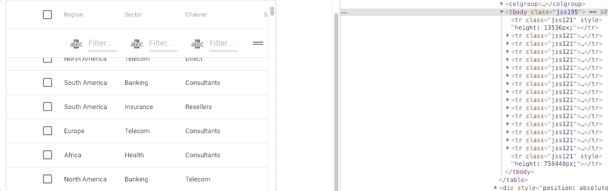

# 性能优化

- 资源压缩合并，减少 HTTP 请求，开启 gzip 压缩
- 非核心代码的异步加载
  - 异步加载方式
  - 异步加载的区别
- 利用浏览器缓存
  - 缓存分类
  - 缓存原理
- 使用 CDN
- DNS 预解析

## [网络优化](网络优化.md)

压缩传输内容，用好缓存

## [webpack 中优化](webpack中优化.md)

主要就是为了减少 Webpack 打包后的文件体积

## [编写高性能的 Javascript](编写高性能的Javascript.md)

## [浏览器渲染](浏览器渲染.md)

## [CDN](CDN.md)

### 插入几万个 DOM，如何实现页面不卡顿？

肯定不能一次性把几万个 DOM 全部插入，这样肯定会造成卡顿，所以解决问题的重点应该是如何分批次部分渲染 DOM。部分人应该可以想到通过 `requestAnimationFrame` 的方式去循环的插入 DOM，其实还有种方式去解决这个问题：**虚拟滚动**（virtualized scroller）。

这种技术的原理就是只渲染可视区域内的内容，非可见区域的那就完全不渲染了，当用户在滚动的时候就实时去替换渲染的内容。

从上图中我们可以发现，即使列表很长，但是渲染的 DOM 元素永远只有那么几个，当我们滚动页面的时候就会实时去更新 DOM，这个技术就能顺利解决这发问题。如果你想了解更多的内容可以了解下这个 [react-virtualized](https://github.com/bvaughn/react-virtualized)。
