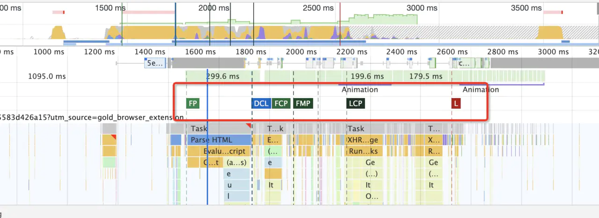
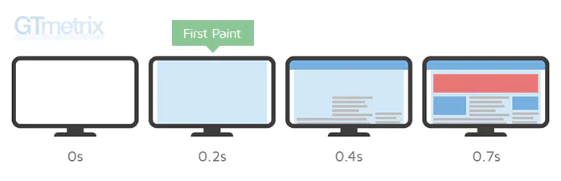
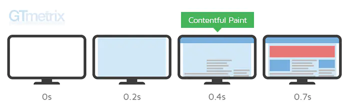

# 性能指标 & 计算

## 性能指标

Chrome Devtool Performance 是大家常用的页面性能分析工具，当你使用它来分析页面加载性能的时候会生成如下图所示的报告。图中包含了以下几个重要的时间点：DCL, L, FP, FCP, FMP, LCP。

### DCL (DOMContentLoaded)

大多数时候，当初始的 HTML 文档被完全加载和解析完成之后，DOMContentLoaded 事件被触发，而无需等待样式表、图像和子框架的完全加载。

而不在 Body 底部的 JavaScript 可以阻塞 DOM 的生成，也就是说当浏览器在解析 HTML 文档时，如果遇到 `<script>`，便会停下对 HTML 文档的解析，转而去处理脚本。如果脚本是内联的，浏览器会先去执行这段内联的脚本，如果是外链的，那么先会去加载脚本，然后执行。在处理完脚本之后，浏览器便继续解析 HTML 文档。另外，因为 JavaScript 可以查询任意对象的样式，所以意味着在 CSS 解析完成，也就是 CSSOM 生成之后，JavaScript 才可以被执行。

DOMContentLoaded 值可以直接在 Chrome 控制台的「Network」栏底部查看。

总结：当文档中没有脚本时，浏览器解析完文档便能触发 DOMContentLoaded 事件；如果文档中包含内联脚本，则脚本会阻塞文档的解析，而脚本需要等 CSSOM 构建完成才能执行。

参考： ./testDemo/test-DOMContentLoaded.html

### defer 与 DOMContentLoaded

如果 script 标签中包含 defer，那么这一块脚本将不会影响 HTML 文档的解析，而是等到 HTML 解析完成后才会执行。而 **DOMContentLoaded 只有在 defer 脚本执行结束后才会被触发**。 所以这意味着什么呢？HTML 文档解析不受影响，等 DOM 构建完成之后 defer 脚本执行，但脚本执行之前需要等待 CSSOM 构建完成。在 DOM、CSSOM 构建完毕，defer 脚本执行完成之后，DOMContentLoaded 事件触发。

### async 与 DOMContentLoaded

如果 script 标签中包含 async，则 HTML 文档构建不受影响，解析完毕后，DOMContentLoaded 触发，而不需要等待 async 脚本执行、样式表加载等等。

### 白屏时间 FP (First Paint)

页面在导航后首次呈现出不同于导航前内容的时间点。
这时候你如果设置了背景颜色的话，就可以看到页面出现了背景色。

### 首屏时间 FCP (First Contentful Paint)

首次绘制任何文本，图像，非空白 canvas 或 SVG 的时间点。

### 首次有效绘制 FMP（First Meaning Paint）

首次有效绘制，标记主角元素渲染完成的时间点，主角元素可以是视频网站的视频控件，内容网站的页面框架也可以是资源网站的头图等。

### LCP (Largest Contentful Paint)

衡量标准视口内可见的最大内容元素的渲染时间。元素包括 img、video、div 及其他块级元素

### TTI (Time to Interactive)

测量页面所有资源加载成功并能够可靠地快速响应用户输入的时间。

### FID (First Input Delay)

测量从用户第一次与页面交互的时间到浏览器实际上能够响应这种交互的时间。交互包括用户点击一个链接或者一个按钮等。

## Performance API

Performance API 用于精确度量、控制、增强浏览器的性能表现。这个 API 为测量网站性能，提供以前没有办法做到的精度。

### performance.timing 对象

performance 对象的 timing 属性指向一个对象，它包含了各种与浏览器性能有关的时间数据，提供浏览器处理网页各个阶段的耗时。

- navigationStart

  - 当前浏览器窗口的前一个网页关闭，发生 unload 事件时的 Unix 毫秒时间戳。如果没有前一个网页，则等于 fetchStart 属性。

- unloadEventStart

  - 如果前一个网页与当前网页属于同一个域名，则返回前一个网页的 unload 事件发生时的 Unix 毫秒时间戳。如果没有前一个网页，或者之前的网页跳转不是在同一个域名内，则返回值为 0。

- unloadEventEnd

  - 如果前一个网页与当前网页属于同一个域名，则返回前一个网页 unload 事件的回调函数结束时的 Unix 毫秒时间戳。如果没有前一个网页，或者之前的网页跳转不是在同一个域名内，则返回值为 0。

- redirectStart

  - 返回第一个 HTTP 跳转开始时的 Unix 毫秒时间戳。如果没有跳转，或者不是同一个域名内部的跳转，则返回值为 0。

- redirectEnd：

  - 返回最后一个 HTTP 跳转结束时（即跳转回应的最后一个字节接受完成时）的 Unix 毫秒时间戳。如果没有跳转，或者不是同一个域名内部的跳转，则返回值为 0。

- fetchStart

  - 返回浏览器准备使用 HTTP 请求读取文档时的 Unix 毫秒时间戳。该事件在网页查询本地缓存之前发生。

- domainLookupStart

  - 返回域名查询开始时的 Unix 毫秒时间戳。如果使用持久连接，或者信息是从本地缓存获取的，则返回值等同于 fetchStart 属性的值。

- domainLookupEnd

  - 返回域名查询结束时的 Unix 毫秒时间戳。如果使用持久连接，或者信息是从本地缓存获取的，则返回值等同于 fetchStart 属性的值。

- connectStart

  - 返回 HTTP 请求开始向服务器发送时的 Unix 毫秒时间戳。如果使用持久连接（persistent connection），则返回值等同于 fetchStart 属性的值。

- connectEnd

  - 返回浏览器与服务器之间的连接建立时的 Unix 毫秒时间戳。如果建立的是持久连接，则返回值等同于 fetchStart 属性的值。连接建立指的是所有握手和认证过程全部结束。

- secureConnectionStart

  - 返回浏览器与服务器开始安全链接的握手时的 Unix 毫秒时间戳。如果当前网页不要求安全连接，则返回 0。

- requestStart

  - 返回浏览器向服务器发出 HTTP 请求时（或开始读取本地缓存时）的 Unix 毫秒时间戳。

- responseStart

  - 返回浏览器从服务器收到（或从本地缓存读取）第一个字节时的 Unix 毫秒时间戳。

- responseEnd

  - 返回浏览器从服务器收到（或从本地缓存读取）最后一个字节时（如果在此之前 HTTP 连接已经关闭，则返回关闭时）的 Unix 毫秒时间戳。

- domLoading

  - 返回当前网页 DOM 结构开始解析时（即 Document.readyState 属性变为“loading”、相应的 readystatechange 事件触发时）的 Unix 毫秒时间戳。

- domInteractive

  - 返回当前网页 DOM 结构结束解析、开始加载内嵌资源时（即 Document.readyState 属性变为“interactive”、相应的 readystatechange 事件触发时）的 Unix 毫秒时间戳。

- domContentLoadedEventStart

  - 返回当前网页 DOMContentLoaded 事件发生时（即 DOM 结构解析完毕、所有脚本开始运行时）的 Unix 毫秒时间戳。

- domContentLoadedEventEnd

  - 返回当前网页所有需要执行的脚本执行完成时的 Unix 毫秒时间戳。

- domComplete

  - 返回当前网页 DOM 结构生成时（即 Document.readyState 属性变为“complete”，以及相应的 readystatechange 事件发生时）的 Unix 毫秒时间戳。

- loadEventStart

  - 返回当前网页 load 事件的回调函数开始时的 Unix 毫秒时间戳。如果该事件还没有发生，返回 0。

- loadEventEnd

  - 返回当前网页 load 事件的回调函数运行结束时的 Unix 毫秒时间戳。如果该事件还没有发生，返回 0。

### performance.now()

performance.now()方法返回当前网页自从 performance.timing.navigationStart 到当前时间之间的毫秒数。由于 performance.now()带有小数，因此精度更高。通过两次调用 performance.now()方法，可以得到间隔的准确时间，用来衡量某种操作的耗时。

### performance.mark()

mark 方法用于为相应的视点做标记。

### performance.getEntries()

浏览器获取网页时，会对网页中每一个对象（脚本文件、样式表、图片文件等等）发出一个 HTTP 请求。performance.getEntries 方法以数组形式，返回这些请求的时间统计信息，有多少个请求，返回数组就会有多少个成员。

### performance.navigation 对象

除了时间信息，performance 还可以提供一些用户行为信息，主要都存放在 performance.navigation 对象上面。

它有两个属性：

#### performance.navigation.type

该属性返回一个整数值，表示网页的加载来源，可能有以下 4 种情况：

- 0

  - 网页通过点击链接、地址栏输入、表单提交、脚本操作等方式加载，相当于常数 performance.navigation.TYPE_NAVIGATENEXT。

- 1

  - 网页通过“重新加载”按钮或者 location.reload()方法加载，相当于常数 performance.navigation.TYPE_RELOAD。

- 2

  - 网页通过“前进”或“后退”按钮加载，相当于常数 performance.navigation.TYPE_BACK_FORWARD。

- 255

  - 任何其他来源的加载，相当于常数 performance.navigation.TYPE_UNDEFINED。

#### performance.navigation.redirectCount

该属性表示当前网页经过了多少次重定向跳转。
