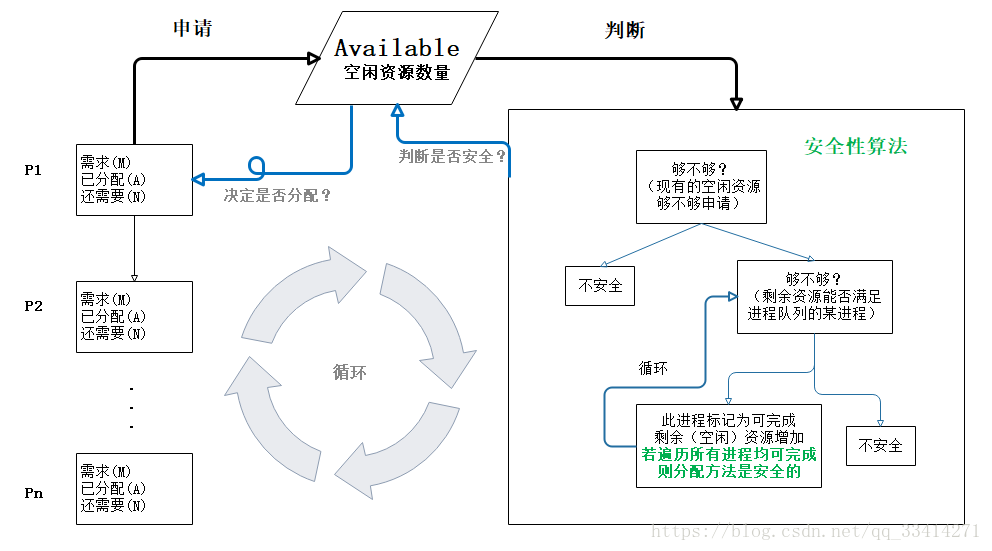

## 死锁

### 死锁概念、产生原因

死锁是指多个进程循环等待彼此占有的资源而无限期的僵持等待下去的局面。原因是：

- 系统提供的资源太少了，远不能满足并发进程对资源的需求
- 进程推进顺序不合适，互相占有彼此需要的资源，同时请求对方占有的资源，往往是程序设计不合理

### 死锁产生的必要条件

需要同时具有以下四个条件：

- 互斥条件：即某个资源在一段时间内只能由一个进程占有，不能同时被两个或两个以上的进程占有
- 不可抢占条件：进程所获得的资源在未使用完毕之前，资源申请者不能强行的从资源占有者手中夺取资源，而只能由该资源的占有者进程自行释放
- 占有且等待条件：进程至少已经占有了一个资源，但又申请了一个新的被其他进程所占有的资源，此时处于等待状态
- 循环等待条件：若干个进程形成环形链，每个都占用对方申请的下一个资源

## 死锁的处理策略

为使系统不发生死锁，必须设法破坏产生死锁的四个必要条件之一，或者允许死锁产生，但当死锁发生时能检测出思索，并有能力实现恢复。
一般有死锁的预防、死锁避免、死锁的检测与恢复三种方法。

1.  死锁预防：破坏导致死锁必要条件中的任意一个就可以预防死锁。例如，要求用户申请资源时一次性申请所需要的全部资源，这就破坏了保持和等待条件；将资源分层，得到上一层资源后，才能够申请下一层资源，它破坏了环路等待条件。预防通常会降低系统的效率。
2.  死锁避免：避免是指进程在每次申请资源时判断这些操作是否安全，例如，使用银行家算法。死锁避免算法的执行会增加系统的开销。
3.  死锁检测：死锁预防和避免都是事前措施，而死锁的检测则是判断系统是否处于死锁状态，如果是，则执行死锁解除策略。
4.  死锁解除：这是与死锁检测结合使用的，它使用的方式就是剥夺。即将某进程所拥有的资源强行收回，分配给其他的进程。

### 死锁预防：

- 打破互斥条件：允许进程同时访问资源（有些资源就是不可以同时访问的，无实用价值）
- 打破不可抢占条件：比如给进程设置优先级，高优先级的可以抢占资源(实现困难，降低系统性能)
- 打破占有且等待条件：实行资源预分配策略，即进程在运行前一次性的向系统申请它所需要的全部资源(不可预测资源的使用，利用率低，降低并发性)
- 破坏循环等待条件：采用这种策略，即把资源事先分类编号，按号分配，使进程在申请，占用资源时不会形成环路。所有进程对资源的请求必须严格按资源序号递增的顺序提出（限制和编号实现困难，增加系统开销，有些资源暂时不用也需要先申请，增加了进程对资源的占用时间）

### 死锁避免

允许进程动态的申请资源，但系统在进行资源分配前，应先计算此次资源分配的安全性。若此次分配不会导致系统进入不安全状态，则将资源你分配给进程，否则，让进程等待。

所谓安全状态，是指系统能按某种进程推进顺序，为每个进程分配其所需的资源，直至满足每个进程对资源的最大需求，是每个进程都可以顺序的完成。此时成 P1P2P3...为安全序列，如果系统无法找到一个安全序列，则称系统处于不安全状态。

并非所有的不安全状态都是死锁状态，但当系统进入不安全状态后，便可能进入死锁状态；反之，只要系统处于安全状态，系统便可以避免进入死锁状态。
**银行家算法**是最著名的死锁避免算法。

### 死锁的检测

资源分配图&&死锁定理

### 死锁解除

1. 资源剥夺法。挂起某些思索进程，并抢占它的资源，将这些资源分配给其他的死锁进程。但应防止被挂起的进程长时间得不到资源时，而处于资源匮乏的状态。
2. 进程撤销法。强制撤销一个或一部分进程并剥夺这些进程的资源。撤销的原则可以按进程的优先级和撤销进程代价的高低进行。
3. 进程回退法。让一个或多个进程回退到足以回避死锁的地步，进程回退时资源释放资源而不是被剥夺。要求系统保持进程的历史信息，设置还原点。

## 银行家算法

当一个进程申请使用资源的时候，银行家算法通过先**试探分配**给该进程资源，然后通过安全性算法**判断分配后的系统是否处于安全状态**，若不安全则试探分配作废，让该进程继续等待。

- 银行家算法中的进程：

  - 包含进程 Pi 的需求资源数量（也是**最大需求资源数量**，MAX）
  - **已分配**给该进程的资源 A（Allocation）
  - **还需要**的资源数量 N（Need=M-A）

- Available 为**空闲资源数量**，即资源池（注意：资源池的剩余资源数量+已分配给所有进程的资源数量=系统中的资源总量）

假设资源 P1 申请资源，银行家算法先试探的分配给它（当然先要看看当前资源池中的资源数量够不够）。
若申请的资源数量小于等于 Available，然后接着判断分配给 P1 后剩余的资源，能不能使进程队列的某个进程执行完毕，若没有进程可执行完毕，则系统处于不安全状态（即此时没有一个进程能够完成并释放资源，随时间推移，系统终将处于死锁状态）。

若有进程可执行完毕，则假设回收已分配给它的资源（剩余资源数量增加），把这个进程标记为可完成，并继续判断队列中的其它进程，若所有进程都可执行完毕，则系统处于安全状态，并根据可完成进程的分配顺序生成安全序列。

如{P0，P3，P2，P1}表示将申请后的剩余资源 Work 先分配给 P0
–>
回收（Work+已分配给 P0 的 A0=Work）
–>
分配给 P3–>回收（Work+A3=Work）
–>
分配给 P2
–>
······
满足所有进程

如此就可避免系统存在潜在死锁的风险。
