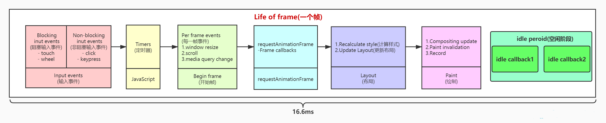

## 屏幕刷新率

- 目前大多数设备的屏幕刷新率为 60 次/秒
- 浏览器渲染动画或页面的每一帧的速率也需要跟设备屏幕的刷新率保持一致

- 页面是一帧一帧绘制出来的，当每秒绘制的帧数（FPS）达到 60 时，页面是流畅的,小于这个值时，用户会感觉到卡顿
- 每个帧的预算时间是 16.66 毫秒 (1 秒/60)
- 1s 60 帧，所以每一帧分到的时间是 1000/60 ≈ 16 ms。所以我们书写代码时力求不让一帧的工作量超过 16ms

## 帧

- 一帧就是一幅静止的画面，连续的帧就形成动画

- 每个帧的开头包括样式计算、布局和绘制
- JavaScript 执行 Javascript 引擎和页面渲染引擎在同一个渲染线程,GUI 渲染和 Javascript 执行两者是互斥的

- 如果某个任务执行时间过长，浏览器会推迟渲染

## 事件循环

为了协调事件，用户交互，脚本，渲染，网络任务等，浏览器必须使用事件循环。

### 流程

1. 从任务队列中取出一个**宏任务**并执行。

2. 检查**微任务**队列，执行并清空微任务队列，如果在微任务的执行中又加入了新的微任务，也会在这一步一起执行。

3. 进入更新渲染阶段，判断是否需要渲染，这里有一个 `rendering opportunity` 的概念，也就是说不一定每一轮 event loop 都会对应一次浏览器渲染，要根据屏幕刷新率、页面性能、页面是否在后台运行来共同决定，通常来说这个渲染间隔是固定的。（所以多个 task 很可能在一次渲染之间执行）

   - 浏览器会尽可能的保持帧率稳定，例如页面性能无法维持 60fps（每 16.66ms 渲染一次）的话，那么浏览器就会选择 30fps 的更新速率，而不是偶尔丢帧。
   - 如果浏览器上下文不可见，那么页面会降低到 4fps 左右甚至更低。
   - 如果满足以下条件，也会跳过渲染：
     - 浏览器判断更新渲染不会带来视觉上的改变。
     - `map of animation frame callbacks` 为空，也就是帧动画回调为空，可以通过 `requestAnimationFrame` 来请求帧动画。

4. 如果上述的判断决定本轮不需要渲染，那么下面的几步也不会继续运行：

   > This step enables the user agent to prevent the steps below from running for other reasons, for example, to ensure certain tasks are executed immediately after each other, with only microtask checkpoints interleaved (and without, e.g., animation frame callbacks interleaved). Concretely, a user agent might wish to coalesce timer callbacks together, with no intermediate rendering updates.
   > 有时候浏览器希望两次「定时器任务」是合并的，他们之间只会穿插着 microTask 的执行，而不会穿插屏幕渲染相关的流程（比如 requestAnimationFrame，下面会写一个例子）。

5. 对于需要渲染的文档，如果窗口的大小发生了变化，执行监听的`resize`方法。

6. 对于需要渲染的文档，如果页面发生了滚动，执行 `scroll` 方法。

7. 对于需要渲染的文档，执行帧动画回调，也就是`requestAnimationFrame`的回调。

8. 对于需要渲染的文档， 执行`IntersectionObserver`的回调。

9. 对于需要渲染的文档，重新渲染绘制用户界面。

10. 判断 `task` 队列和 `microTask` 队列是否都为空，如果是的话，则进行 `Idle` 空闲周期的算法，判断是否要执行 `requestIdleCallback` 的回调函数。
