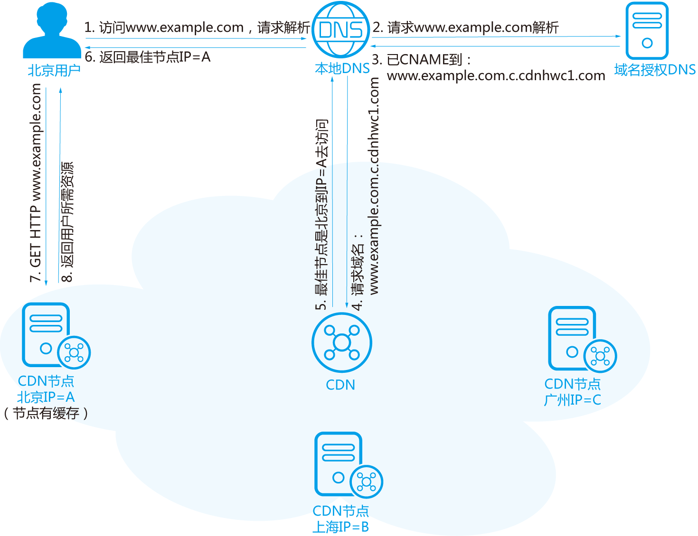

# CDN

CDN（Content Delivery Network，内容分发网络）是构建在现有互联网基础之上的一层智能虚拟网络，通过在网络各处部署节点服务器，实现将源站内容分发至所有 CDN 节点，使用户可以就近获得所需的内容。CDN 服务缩短了用户查看内容的访问延迟，提高了用户访问网站的响应速度与网站的可用性，解决了网络带宽小、用户访问量大、网点分布不均等问题。

## 加速原理

当用户访问使用 CDN 服务的网站时，本地 DNS 服务器通过 CNAME 方式将最终域名请求重定向到 CDN 服务。CDN 通过一组预先定义好的策略(如内容类型、地理区域、网络负载状况等)，将当时能够最快响应用户的 CDN 节点 IP 地址提供给用户，使用户可以以最快的速度获得网站内容。使用 CDN 后的 HTTP 请求处理流程如下：

### CDN 节点有缓存场景

1. 用户在浏览器输入要访问的网站域名，向本地 DNS 发起域名解析请求。
2. 域名解析的请求被发往网站授权 DNS 服务器。
3. 网站 DNS 服务器解析发现域名已经 CNAME 到了 www.example.com.c.cdnhwc1.com。
4. 请求被指向 CDN 服务。
5. CDN 对域名进行智能解析，将响应速度最快的 CDN 节点 IP 地址返回给本地 DNS。
6. 用户获取响应速度最快的 CDN 节点 IP 地址。
7. 浏览器在得到速度最快节点的 IP 地址以后，向 CDN 节点发出访问请求。
8. CDN 节点将用户所需资源返回给用户。

### CDN 节点无缓存场景

1. 用户在浏览器输入要访问的网站域名，向本地 DNS 发起域名解析请求。
2. 域名解析的请求被发往网站授权 DNS 服务器。
3. 网站 DNS 服务器解析发现域名已经 CNAME 到了 www.example.com.c.cdnhwc1.com。
4. 请求被指向 CDN 服务。
5. CDN 对域名进行智能解析，将响应速度最快的 CDN 节点 IP 地址返回给本地 DNS。
6. 用户获取响应速度最快的 CDN 节点 IP 地址。
7. 浏览器在得到速度最快节点的 IP 地址以后，向 CDN 节点发出访问请求。
8. CDN 节点回源站拉取用户所需资源。
9. 将回源拉取的资源缓存至节点。
10. 将用户所需资源返回给用户。

PS：CNAME 别名解析是将域名指向一个网址（域名）
