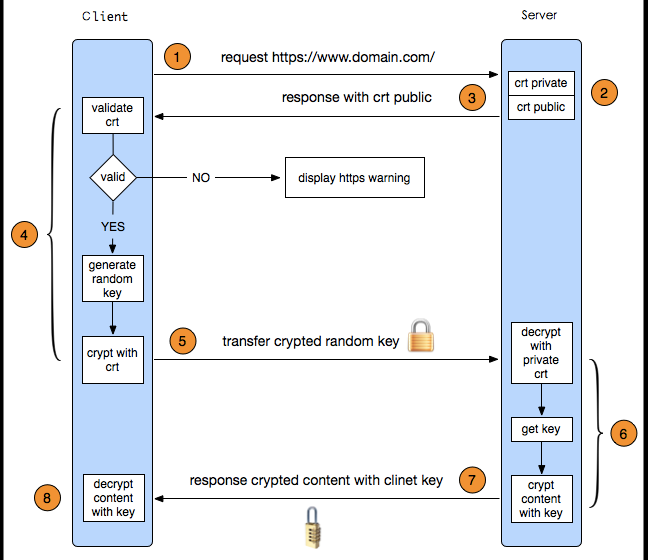

# HTTPS

http 默认采用 80 作为通讯端口，对于传输采用不加密的方式，https 默认采用 443，对于传输的数据进行加密传输。

## 密码学基础

明文： 明文指的是未被加密过的原始数据。

密文：明文被某种加密算法加密之后，会变成密文，从而确保原始数据的安全。密文也可以被解密，得到原始的明文。

密钥：密钥是一种参数，它是在明文转换为密文或将密文转换为明文的算法中输入的参数。密钥分为对称密钥与非对称密钥，分别应用在对称加密和非对称加密上。

### 对称加密

对称加密又叫做私钥加密，即信息的发送方和接收方使用同一个密钥去加密和解密数据。对称加密的特点是算法公开、加密和解密速度快，适合于对大数据量进行加密，常见的对称加密算法有 DES、3DES、TDEA、Blowfish、RC5 和 IDEA。

```
其加密过程如下：明文 + 加密算法 + 私钥 => 密文
解密过程如下：密文 + 解密算法 + 私钥 => 明文
```

对称加密中用到的密钥叫做私钥，私钥表示个人私有的密钥，即该密钥不能被泄露。

其加密过程中的私钥与解密过程中用到的私钥是同一个密钥，这也是称加密之所以称之为“对称”的原因。由于对称加密的算法是公开的，所以一旦私钥被泄露，那么密文就很容易被破解，所以对称加密的缺点是密钥安全管理困难。

### 非对称加密

非对称加密也叫做公钥加密。非对称加密与对称加密相比，其安全性更好。对称加密的通信双方使用相同的密钥，如果一方的密钥遭泄露，那么整个通信就会被破解。而非对称加密使用一对密钥，即公钥和私钥，且二者成对出现。私钥被自己保存，不能对外泄露。公钥指的是公共的密钥，任何人都可以获得该密钥。用公钥或私钥中的任何一个进行加密，用另一个进行解密。

- **被公钥加密过的密文只能被私钥解密**，过程如下：

```
明文 + 加密算法 + 公钥 => 密文， 密文 + 解密算法 + 私钥 => 明文
```

- **被私钥加密过的密文只能被公钥解密**，过程如下：

```
明文 + 加密算法 + 私钥 => 密文， 密文 + 解密算法 + 公钥 => 明文
```

由于加密和解密使用了两个不同的密钥，这就是非对称加密“非对称”的原因。
非对称加密的缺点是加密和解密花费时间长、速度慢，只适合对少量数据进行加密。
在非对称加密中使用的主要算法有：RSA、Elgamal、Rabin、D-H、ECC（椭圆曲线加密算法）等。

## HTTPS 通信过程

**HTTPS 协议 = HTTP 协议 + SSL/TLS 协议**，在 HTTPS 数据传输的过程中，需要用 SSL/TLS 对数据进行加密和解密，需要用 HTTP 对加密后的数据进行传输，由此可以看出 HTTPS 是由 HTTP 和 SSL/TLS 一起合作完成的。

**SSL**的全称是 Secure Sockets Layer，即安全套接层协议，是为网络通信提供安全及数据完整性的一种安全协议。SSL 协议在 1994 年被 Netscape 发明，后来各个浏览器均支持 SSL，其最新的版本是 3.0。

**TLS**的全称是 Transport Layer Security，即安全传输层协议，最新版本的 TLS（Transport Layer Security，传输层安全协议）是 IETF（Internet Engineering Task Force，Internet 工程任务组）制定的一种新的协议，它建立在 SSL 3.0 协议规范之上，是 SSL 3.0 的后续版本。在 TLS 与 SSL3.0 之间存在着显著的差别，主要是它们所支持的加密算法不同，所以 TLS 与 SSL3.0 不能互操作。虽然 TLS 与 SSL3.0 在加密算法上不同，但是在我们理解 HTTPS 的过程中，我们可以把 SSL 和 TLS 看做是同一个协议。

HTTPS 为了兼顾安全与效率，**同时使用了对称加密和非对称加密**。数据是被对称加密传输的，对称加密过程需要客户端的一个密钥，为了确保能把该密钥安全传输到服务器端，采用非对称加密对该密钥进行加密传输，总的来说，**对数据进行对称加密，对称加密所要使用的密钥通过非对称加密传输**。



HTTPS 在传输的过程中会涉及到三个密钥：

- 服务器端的公钥和私钥，用来进行非对称加密
- 客户端生成的随机密钥，用来进行对称加密

一个 HTTPS 请求实际上包含了两次 HTTP 传输，可以细分为 8 步。

1. 客户端向服务器发起 HTTPS 请求，连接到服务器的 443 端口
2. 服务器端有一个密钥对，即公钥和私钥，是用来进行非对称加密使用的，服务器端保存着私钥，不能将其泄露，公钥可以发送给任何人。
3. 服务器将自己的公钥发送给客户端。
4. 客户端收到服务器端的公钥之后，会对公钥进行检查，验证其合法性，如果发现发现公钥有问题，那么 HTTPS 传输就无法继续。严格的说，这里应该是验证服务器发送的数字证书的合法性。如果公钥合格，那么客户端会生成一个随机值，这个随机值就是用于进行对称加密的密钥，我们将该密钥称之为 client key，即客户端密钥，这样在概念上和服务器端的密钥容易进行区分。然后用服务器的公钥对客户端密钥进行非对称加密，这样客户端密钥就变成密文了，至此，HTTPS 中的第一次 HTTP 请求结束。
5. 客户端会发起 HTTPS 中的第二个 HTTP 请求，将加密之后的客户端密钥发送给服务器。
6. 服务器接收到客户端发来的密文之后，会用自己的私钥对其进行非对称解密，解密之后的明文就是客户端密钥，然后用客户端密钥对数据进行对称加密，这样数据就变成了密文。
7. 然后服务器将加密后的密文发送给客户端。
8. 客户端收到服务器发送来的密文，用客户端密钥对其进行对称解密，得到服务器发送的数据。这样 HTTPS 中的第二个 HTTP 请求结束，整个 HTTPS 传输完成。

原文链接：https://www.jianshu.com/p/14cd2c9d2cd2
