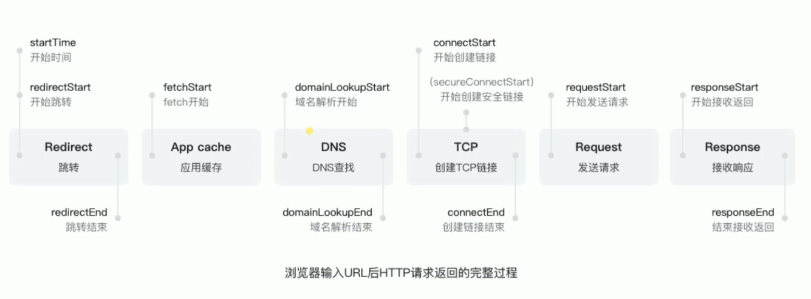

### 从输入URL到页面加载完成的过程

[参考链接](https://segmentfault.com/a/1190000006879700)

 - 判断是否需要跳转(301)
 - 从浏览器中读取缓存
 - DNS解析
 - TCP连接
 - HTTP请求发出
 - 服务端处理请求，HTTP响应返回
 - 浏览器拿到响应数据，解析响应内内容，把解析结果展示给用户

1. 在浏览器地址栏输入URL
2. 判断是否有永久重定向(301)
   1. 如果有，直接跳转到对应URL
3. 浏览器查看资源是否有**强缓存**，有则直接使用，如果是**协商缓存**则需要到服务器进行校验资源是否可用
    1. 检验新鲜通常有两个HTTP头进行控制`Expires`和`Cache-Control`：
        - HTTP1.0提供Expires，值为一个绝对时间表示缓存新鲜日期
        - HTTP1.1增加了Cache-Control: max-age=,值为以秒为单位的最大新鲜时间
4. 浏览器**解析URL**获取协议，主机，端口，path
5. 浏览器**组装一个HTTP（GET）请求报文**
6. **DNS解析**，查找过程如下：
    1. 浏览器缓存
    2. 本机缓存
    3. hosts文件
    4. 路由器缓存
    5. ISP DNS缓存
    6. DNS查询（递归查询 / 迭代查询）
7. **端口建立TCP链接**，三次握手如下：
    1. 客户端发送一个TCP的**SYN=1，Seq=X**的包到服务器端口
    2. 服务器发回**SYN=1， ACK=X+1， Seq=Y**的响应包
    3. 客户端发送**ACK=Y+1， Seq=Z**
8. TCP链接建立后**发送HTTP请求**
9.  服务器接受请求并解析，将请求转发到服务程序，如虚拟主机使用HTTP Host头部判断请求的服务程序
10. 服务器检查**HTTP请求头是否包含缓存验证信息**如果验证缓存新鲜，返回**304**等对应状态码
11. 处理程序读取完整请求并准备HTTP响应，可能需要查询数据库等操作
12. 服务器将**响应报文通过TCP连接发送回浏览器**
13. 浏览器接收HTTP响应，然后根据情况选择**关闭TCP连接或者保留重用，关闭TCP连接的四次挥手如下**：
    1. 主动方发送**Fin=1， Ack=Z， Seq= X**报文
    2. 被动方发送**ACK=X+1， Seq=Z**报文
    3. 被动方发送**Fin=1， ACK=X， Seq=Y**报文
    4. 主动方发送**ACK=Y， Seq=X**报文
14. 浏览器检查响应状态吗：是否为1XX，3XX， 4XX， 5XX，这些情况处理与2XX不同
15. 如果资源可缓存，**进行缓存**
16. 对响应进行**解码**（例如gzip压缩）
17. 根据资源类型决定如何处理（假设资源为HTML文档）
18. **解析HTML文档，构件DOM树，下载资源，构造CSSOM树，执行js脚本**，这些操作没有严格的先后顺序，以下分别解释
19. **构建DOM树**：
    1. **Tokenizing**：根据HTML规范将字符流解析为标记
    2. **Lexing**：词法分析将标记转换为对象并定义属性和规则
    3. **DOM construction**：根据HTML标记关系将对象组成DOM树
20. 解析过程中遇到图片、样式表、js文件，**启动下载**
21. 构建**CSSOM树**：
    1. **Tokenizing**：字符流转换为标记流
    2. **Node**：根据标记创建节点
    3. **CSSOM**：节点创建CSSOM树
22. **[根据DOM树和CSSOM树构建渲染树](https://developers.google.com/web/fundamentals/performance/critical-rendering-path/render-tree-construction)**:
    1. 从DOM树的根节点遍历所有**可见节点**，不可见节点包括：1）`script`,`meta`这样本身不可见的标签。2)被css隐藏的节点，如`display: none`
    2. 对每一个可见节点，找到恰当的CSSOM规则并应用
    3. 发布可视节点的内容和计算样式
23. **js解析如下**：
    1. 浏览器创建Document对象并解析HTML，将解析到的元素和文本节点添加到文档中，此时**document.readystate为loading**
    2. HTML解析器遇到**没有async和defer的script时**，将他们添加到文档中，然后执行行内或外部脚本。这些脚本会同步执行，并且在脚本下载和执行时解析器会暂停。这样就可以用document.write()把文本插入到输入流中。**同步脚本经常简单定义函数和注册事件处理程序，他们可以遍历和操作script和他们之前的文档内容**
    3. 当解析器遇到设置了**async**属性的script时，开始下载脚本并继续解析文档。脚本会在它**下载完成后尽快执行**，但是**解析器不会停下来等它下载**。异步脚本**禁止使用document.write()**，它们可以访问自己script和之前的文档元素
    4. 当文档完成解析，document.readState变成interactive
    5. 所有**defer**脚本会**按照在文档出现的顺序执行**，延迟脚本**能访问完整文档树**，禁止使用document.write()
    6. 浏览器**在Document对象上触发DOMContentLoaded事件**
    7. 此时文档完全解析完成，浏览器可能还在等待如图片等内容加载，等这些**内容完成载入并且所有异步脚本完成载入和执行**，document.readState变为complete,window触发load事件
24. **显示页面**（HTML解析过程中会逐步显示页面）
