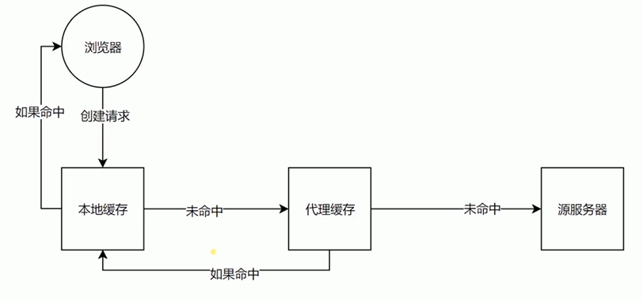

# 缓存

可缓存性
 - public
   - 指HTTP请求返回的资源在所经过的所有路径包括一些中间代理服务器以及发出这个请求的客户端浏览器都可以进行缓存
 - private
   - 代表发起请求的浏览器才可以进行缓存
 - no-cache
   - 指可以存缓存，但是每次使用都需要去服务端验证
 - no-store
   - 本地和代理服务器都不允许去缓存
 - no-transform
   - 不允许代理/缓存服务器转换文件格式

到期
 - max-age=<seconds\>
   - 缓存到期时间
 - s-maxage=<seconds\> 
   - 代理服务器专用
 - max-stale=<seconds\> 
   - 指示客户机可以使用超出max-age时间的响应

重新验证
 - must-revalidate
   - 设置了max-age的资源过期后必须到源服务端验证资源是否还可用
 - proxy-revalidate
   - （缓存服务器用）设置了max-age的资源过期后必须到源服务端验证资源是否还可用

  
### 缓存方案

需求：
有的静态资源会设置一个较长的缓存时间，但是我们希望用户还是能使用最新的资源。

解决方案：
在打包完成的文件名上加上一串哈希码，这个哈希码是根据内容进行的哈希计算。 
所以，如果你的内容文件没有变，那么这个hash码不会变，即这个静态资源的url没有变。 而如果内容有变，那么hash码也会变，浏览器就会去请求新的资源请求。

普通的缓存机制：

### 资源验证
如果给Cache-Control设置了no-cache后，每次要使用资源时浏览器都要到服务器验证缓存是否过期。 如果直接使用缓存，返回码：**304**

如何验证资源是否过期：
 - Last-Modified（上次修改时间）
   - 配合 If-Modified-Since 或 If-Unmodified-Since 使用
   - 如果请求的资源头中有Last-Modified这个头，这个头指定了一个时间。那么浏览器重新访问资源时就会带上If-Modified-Since这个头，其时间是Last-Modified的时间，服务器就会拿这个时间去对比上次修改的时间，然后告诉浏览器是否可以直接使用。

 - Etag （数据签名）
   - 资源会依据它的内容产生一个唯一的数据签名，如果资源有更新，那么Etag就会发生变化。
   - 配合 If-Match 或 If-None-Match 使用