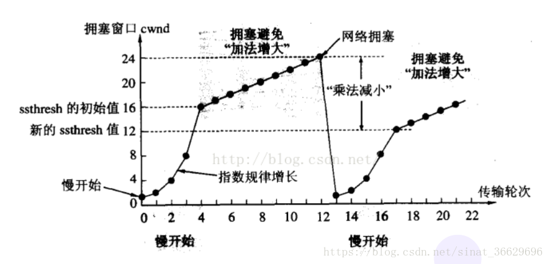

# TCP

TCP（Transmission Control Protocol），又叫传输控制协议。
TCP 协议是面向连接的，可靠的，基于字节流的传输协议。在基于 TCP 进行通信时，通信双方需要先建立一个 TCP 连接，建立连接需要经过三次握手，断开连接的时候需要经过四次挥手。

### TCP 头部

对于 TCP 头部来说，以下几个字段是很重要的:

- `序列号` （Sequence number），这个序号保证了 TCP 传输的报文都是有序的，对端可以通过序号顺序的拼接报文

- `确认号` （Acknowledgement Number），这个序号表示数据接收端期望接收的下一个字节的编号是多少，同时也表示上一个序号的数据已经收到

- `窗口大小` （Window Size），表示还能接收多少字节的数据，用于流量控制

- `标识符`
  - ACK=1 ：该字段为一表示确认号字段有效。此外，TCP 还规定在连接建立后传送的所有报文段都必须把 ACK 置为一。
  - SYN=1：当 SYN=1，ACK=0 时，表示当前报文段是一个连接请求报文。当 SYN=1，ACK=1 时，表示当前报文段是一个同意建立连接的应答报文。
  - FIN=1：该字段为一表示此报文段是一个释放连接的请求报文。
  - URG=1 : 该字段为一表示本数据报的数据部分包含紧急信息，是一个高优先级数据报文，此时紧急指针有效。紧急数据一定位于当前数据包数据部分的最前面，紧急指针标明了紧急数据的尾部。
  - PSH=1 ：该字段为一表示接收端应该立即将数据 push 给应用层，而不是等到缓冲区满后再提交。
  - RST=1：该字段为一表示当前 TCP 连接出现严重问题，可能需要重新建立 TCP 连接，也可以用于拒绝非法的报文段和拒绝连接请求。

### 三次握手

简单的说：

- 第一次握手

  - SYN = 1， seq(client) = x
  - 客户端向服务端发送连接请求报文段。该报文段中包含自身的数据通讯初始序号。请求发送后，客户端便进入 SYN-SENT 状态。

- 第二次握手

  - SYN = 1，ACK = 1，确认序号 = x+1, seq(server) = y
  - 服务端收到连接请求报文段后，如果同意连接，则会发送一个应答，该应答中也会包含自身的数据通讯初始序号，发送完成后便进入 SYN-RECEIVED 状态

- 第三次握手
  - ACK = 1，确认序号 = y+1, seq(client) = x + 1
  - 客户端收到连接同意的应答后，还要向服务端发送一个确认报文。客户端发完这个报文段后便进入 ESTABLISHED 状态，服务端收到这个应答后也进入 ESTABLISHED 状态，此时连接建立成功。

### 为什么不用两次握手？

主要是为了防止已经失效的连接请求报文突然又传送到了服务器，从而产生错误。

假设有这样一种场景, 客户端发送的第一个请求连接并且没有丢失，但是被滞留的时间太长。由于 TCP 的客户端迟迟没有收到确认报文，以为服务器没有收到，此时重新向服务器发送报文。
而现在第一个请求到达服务端，这个请求已经报废了，但是又会建立连接。

如果采用的是三次握手，就算是那一次失效的报文传送过来了，服务端接受到了那条失效报文并且回复了确认报文，但是客户端不会再次发出确认。由于服务器收不到确认，就知道客户端并没有请求连接。

### 四次挥手

TCP 是全双工的，在断开连接时两端都需要发送 FIN 和 ACK。

- 第一次挥手

  - 若客户端 A 认为数据发送完成，则它需要向服务端 B 发送连接释放请求。

- 第二次挥手

  - B 收到连接释放请求后，会告诉应用层要释放 TCP 链接。然后会发送 ACK 包，并进入 **CLOSE_WAIT** 状态，表示 A 到 B 的连接已经释放，不接收 A 发的数据了。但是因为 **TCP 连接时双向的**，所以 B 仍旧可以发送数据给 A。

- 第三次挥手

  - B 如果此时还有没发完的数据会继续发送，完毕后会向 A 发送连接释放请求，然后 B 便进入**LAST-ACK**状态。
  - PS：通过延迟确认的技术（通常有时间限制，否则对方会误认为需要重传），可以将第二次和第三次握手合并，延迟 ACK 包的发送。

- 第四次挥手
  - A 收到释放请求后，向 B 发送确认应答，此时 A 进入 **TIME-WAIT** 状态。该状态会持续 2MSL（最大段生存期，指报文段在网络中生存的时间，超时会被抛弃） 时间，若该时间段内没有 B 的重发请求的话，就进入 **CLOSED** 状态。当 B 收到确认应答后，也便进入 CLOSED 状态。

### 为什么 A 要进入 TIME-WAIT 状态，等待 2MSL 时间后才进入 CLOSED 状态？

为了保证 B 能收到 A 的确认应答。若 A 发完确认应答后直接进入 CLOSED 状态，如果确认应答因为网络问题一直没有到达，那么会造成 B 不能正常关闭。

### 为什么建立连接是三次握手，关闭连接确是四次挥手呢？

建立连接的时候， 服务器在 LISTEN 状态下，收到建立连接请求的 SYN 报文后，把 ACK 和 SYN 放在一个报文里发送给客户端。

而关闭连接时，服务器收到对方的 FIN 报文时，仅仅表示对方不再发送数据了但是还能接收数据，而自己也未必全部数据都发送给对方了

## ARQ （超时重传）协议

通过确认和超时机制保证了数据的正确送达，ARQ 协议包含`停止等待 ARQ` 和`连续 ARQ`

### 停止等待 ARQ

**正常传输过程**

只要 A 向 B 发送一段报文，都要停止发送并启动一个定时器，等待对端回应，在定时器时间内接收到对端应答就取消定时器并发送下一段报文。

**当报文丢失或出错：**

报文传输的过程中丢包： 这时候超过定时器设定的时间就会再次发送丢包的数据直到对端响应，所以需要每次都备份发送的数据。

传输过程中报文出错： 对端会抛弃该报文并等待 A 端重传。

PS：一般定时器设定的时间都会大于一个 RTT 的平均时间。

**ACK 超时或丢失：**

对端传输的应答也可能出现丢失或超时的情况。那么超过定时器时间 A 端照样会重传报文。这时候 B 端收到相同序号的报文会丢弃该报文并重传应答，直到 A 端发送下一个序号的报文。

这个协议的缺点就是传输效率低，在良好的网络环境下每次发送报文都得等待对端的 ACK 。

### 连续 ARQ

在连续 ARQ 中，发送端拥有一个发送窗口，可以在没有收到应答的情况下持续发送窗口内的数据，这样相比停止等待 ARQ 协议来说减少了等待时间，提高了效率。

#### 累计确认

连续 ARQ 中，接收端会持续不断收到报文。如果和停止等待 ARQ 中接收一个报文就发送一个应答一样，就太浪费资源了。通过累计确认，可以在收到多个报文以后统一回复一个应答报文。报文中的 ACK 可以用来告诉发送端这个序号之前的数据已经全部接收到了，下次请发送这个序号 + 1 的数据。

但是累计确认也有一个弊端。在连续接收报文时，可能会遇到接收到序号 5 的报文后，并未接到序号 6 的报文，然而序号 7 以后的报文已经接收。遇到这种情况时，ACK 只能回复 6，这样会造成发送端重复发送数据，这种情况下可以通过 Sack 来解决。

#### 滑动窗口

上面讲到了发送窗口。在 TCP 中，两端都维护着窗口：分别为发送端窗口和接收端窗口。

发送端窗口包含已发送但未收到应答的数据和可以发送但是未发送的数据。

发送端窗口是由接收窗口剩余大小决定的。接收方会把当前接收窗口的剩余大小写入应答报文，发送端收到应答后根据该值和当前网络拥塞情况设置发送窗口的大小，所以发送窗口的大小是不断变化的。

当发送端接收到应答报文后，会随之将窗口进行滑动

**滑动窗口实现了流量控制**。接收方通过报文告知发送方还可以发送多少数据，从而保证接收方能够来得及接收数据。

**Zero 窗口**

在发送报文的过程中，可能会遇到对端出现零窗口的情况。在该情况下，发送端会停止发送数据，并启动 persistent timer 。该定时器会定时发送请求给对端，让对端告知窗口大小。在重试次数超过一定次数后，可能会中断 TCP 链接。

## 拥塞处理

拥塞处理和流量控制不同，后者是作用于接收方，保证接收方来得及接受数据。而前者是作用于网络，防止过多的数据拥塞网络，避免出现网络负载过大的情况。

拥塞处理包括了四个算法，分别为：慢开始，拥塞避免，快速重传，快速恢复。

### 慢开始算法

慢开始算法，顾名思义，就是在传输开始时将发送窗口从 1 开始指数级扩大，从而避免一开始就传输大量数据导致网络拥塞。

慢开始算法步骤具体如下

1. 连接初始设置拥塞窗口（Congestion Window） 为 1 MSS（一个分段的最大数据量）
2. 每过一个 RTT (往返时延) 就将窗口大小乘二
3. 指数级增长肯定不能没有限制的，所以有一个阈值限制，当窗口大小大于阈值时就会启动拥塞避免算法

### 拥塞避免算法

拥塞避免算法相比简单点，每过一个 RTT 窗口大小只加一，这样能够避免指数级增长导致网络拥塞，慢慢将大小调整到最佳值。

在传输过程中可能定时器超时的情况，这时候 TCP 会认为网络拥塞了，会马上进行以下步骤：

- 将阈值设为当前拥塞窗口的一半
- 将拥塞窗口设为 1 MSS
- 启动拥塞避免算法

### 快速重传

快速重传一般和快恢复一起出现。一旦接收端收到的报文出现失序的情况，接收端只会回复最后一个顺序正确的报文序号（没有 Sack 的情况下）。如果收到三个重复的 ACK，无需等待定时器超时再重发而是启动快速重传。具体算法分为两种：

### RTT 与 RTO

- **RTT**(Round Trip Time)
  - 一个连接的往返时间，即数据发送时刻到接收到确认的时刻的差值。
- **RTO**(Retransmission Time Out)
  - 重传超时时间，即从数据发送时刻算起，超过这个时间便执行重传。
- RTT 和 RTO 的关系是
  - 由于网络波动的不确定性，每个 RTT 都是动态变化的，所以 RTO 也应随着 RTT 动态变化。

[博客链接](https://blog.csdn.net/whgtheone/article/details/80970292)

### TCP 小结

为什么 TCP 这么复杂?

因为既要保证可靠性, 同时又要尽可能提高性能

保证可靠性的机制

- 校验和
- 序列号(按序到达)
- 确认应答
- 超时重传
- 连接管理
- 流量控制
- 拥塞控制

提高性能的机制

- 滑动窗口
- 快速重传
- 延迟应答
- 捎带应答

定时器

- 超时重传定时器
- 保活定时器
- TIME_WAIT 定时器

### 基于 TCP 的应用层协议

- HTTP
- HTTPS
- SSH
- Telnet
- FTP
- SMTP
